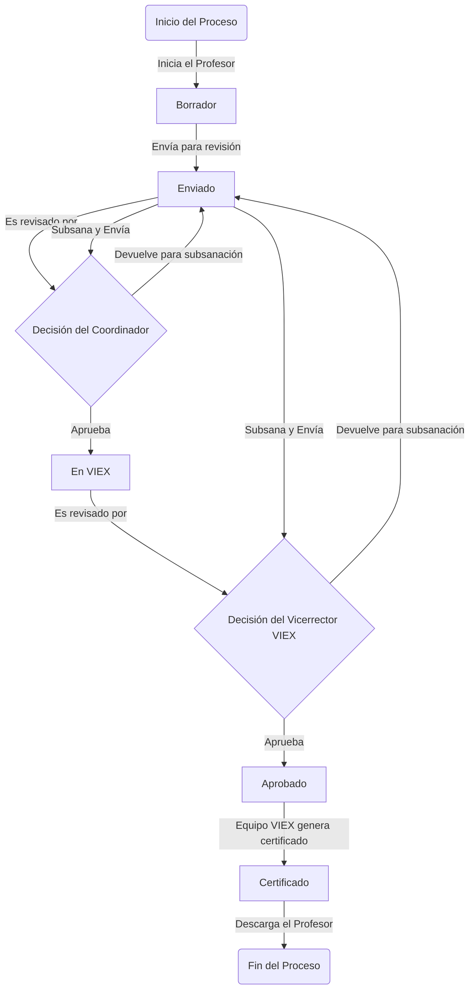

# VIEX - Plataforma de Registro y Certificación de Trabajos de Extensión

[](https://laravel.com)
[](https://php.net)
[](https://oracle.com)

VIEX es una plataforma web para la Universidad de Panamá que digitaliza el proceso de registro, gestión y certificación de trabajos de extensión universitarios. Implementa el flujo establecido en el "Manual de Procedimientos Para Presentar Trabajos de Extensión".

## 📋 Características Principales

- ✅ **Gestión completa del ciclo de vida** de trabajos de extensión
- ✅ **Autenticación integrada** con sistema Oracle universitario
- ✅ **Flujo de aprobación multi-nivel** (Profesor → Coordinador → Decano → VIEX)
- ✅ **Sistema de roles y permisos** avanzado (Spatie Laravel Permission)
- ✅ **Gestión documental** con Spatie Media Library
- ✅ **Notificaciones automáticas** y comunicación interna
- ✅ **Reportes y estadísticas** institucionales
- ✅ **Interfaz responsiva** con AdminLTE 3

## 🏗️ Arquitectura

### Stack Tecnológico
- **Backend**: Laravel 11+ con PHP 8.2+
- **Base de Datos**: Oracle (producción) / SQLite (desarrollo)
- **Frontend**: Vite + AdminLTE 3 + Blade templates
- **Autenticación**: Sistema híbrido (Oracle + Laravel Sanctum)
- **Autorización**: Spatie/Laravel-Permission (RBAC)
- **Archivos**: Spatie/Laravel-MediaLibrary

### Modelo de Dominio
El sistema maneja **4 tipos de trabajos de extensión**:
1. **Proyectos** - Institucionales, Unidades Académicas, Servicio Social
2. **Actividades** - Educación continua, intervenciones puntuales
3. **Publicaciones** - Artículos, libros que generen conocimiento
4. **Asistencias Técnicas** - Asesorías y consultorías

## 🚀 Instalación y Configuración

### Prerrequisitos
- PHP 8.2 o superior
- Composer
- Node.js 16+ y npm
- Base de datos Oracle (producción) o SQLite (desarrollo)

### Instalación Local

1. **Clonar el repositorio**
   ```bash
   git clone <repository-url>
   cd vi-ex
   ```

   1.1. **Instalar dependencias del servidor**
   ```bash
   sudo apt update
   sudo apt install php8.2 php8.2-cli php8.2-common php8.2-mysql php8.2-zip php8.2-gd php8.2-mbstring php8.2-curl php8.2-xml php8.2-bcmath php8.2-oci8 -y
   ```
   1.2. **Instalar Composer**
   ```bash
   curl -sS https://getcomposer.org/installer | php
   sudo mv composer.phar /usr/local/bin/composer
   ```  
   1.3. **Instalar Node.js**
   ```bash
   curl -fsSL https://deb.nodesource.com/setup_18.x | sudo -E bash -
   sudo apt-get install -y nodejs
   ```

2. **Instalar dependencias PHP**
   ```bash
   composer install --no-interaction --prefer-dist
   ```

3. **Instalar dependencias JavaScript**
   ```bash
   npm ci
   ```

4. **Configurar entorno**
   ```bash
   cp .env.example .env
   php artisan key:generate
   ```

5. **Configurar base de datos**
   - Para desarrollo (SQLite):
     ```bash
     touch database/database.sqlite
     ```
   - Para producción (Oracle): Configurar conexión en `.env`

6. **Ejecutar migraciones y seeders**
   ```bash
   php artisan migrate --seed
   ```

7. **Publicar recursos de paquetes**
   ```bash
   php artisan vendor:publish --provider="Spatie\Permission\PermissionServiceProvider"
   php artisan vendor:publish --provider="Spatie\MediaLibrary\MediaLibraryServiceProvider"
   ```

8. **Compilar assets**
   ```bash
   npm run build
   ```

9. **Iniciar servidor de desarrollo**
   ```bash
   php artisan serve
   ```

## 🔐 Autenticación

VIEX utiliza un sistema de autenticación híbrido:

### Autenticación Oracle (Producción)
- Integración con `UP_ADMSIS.PKG_VALIDA_USER`
- Validación de 3 estamentos: Profesor, Administrativo, Estudiante
- Campos de cédula segmentados (provincia, clase, tomo, folio)

### Autenticación Laravel (Desarrollo)
- Sistema estándar de Laravel con Sanctum
- Para testing y desarrollo local

## 👥 Roles y Permisos

| Rol | Descripción | Permisos |
|-----|-------------|----------|
| **Super Admin** | Control total del sistema | Todos |
| **VIEX Admin** | Administración de evaluaciones | Gestión de trabajos, reportes |
| **Profesor** | Usuario docente | Crear/editar trabajos propios |
| **Coordinador** | Coordinador de extensión | Aprobar trabajos de su unidad |
| **Decano/Director** | Autoridad académica | Aprobación institucional |
| **Evaluador** | Evaluador externo | Evaluar trabajos asignados |

## 📊 Flujo de Trabajo



## 🛠️ Comandos de Desarrollo

### Base de Datos
```bash
# Migrar con datos de prueba
php artisan migrate:fresh --seed

# Solo migrar
php artisan migrate

# Rollback
php artisan migrate:rollback
```

### Assets
```bash
# Desarrollo con hot reload
npm run dev

# Build para producción
npm run build

# Build para desarrollo
npm run development
```

### Cache y Optimización
```bash
# Limpiar todos los caches
php artisan optimize:clear

# Generar cache para producción
php artisan config:cache
php artisan route:cache
php artisan view:cache
```

### Testing
```bash
# Ejecutar tests
php artisan test

# Con coverage
php artisan test --coverage
```

## 🚀 Despliegue a Producción

### Prerrequisitos de Producción

#### Servidor
- **SO**: Linux (Ubuntu 20.04+ recomendado)
- **Web Server**: Apache 2.4+ o Nginx 1.18+
- **PHP**: 8.2+ con extensiones requeridas
- **Base de Datos**: Oracle Database 19c+
- **Node.js**: 16+ (para builds)

#### Extensiones PHP Requeridas
```
php8.2-cli php8.2-common php8.2-mysql php8.2-zip php8.2-gd php8.2-mbstring php8.2-curl php8.2-xml php8.2-bcmath php8.2-oci8
```

#### Configuración del Servidor

##### Nginx Configuration
```nginx
server {
    listen 80;
    server_name vi-ex.up.edu.pa;
    root /var/www/vi-ex/public;
    index index.php index.html;

    # Logs
    access_log /var/log/nginx/vi-ex_access.log;
    error_log /var/log/nginx/vi-ex_error.log;

    # Security headers
    add_header X-Frame-Options "SAMEORIGIN" always;
    add_header X-XSS-Protection "1; mode=block" always;
    add_header X-Content-Type-Options "nosniff" always;
    add_header Referrer-Policy "no-referrer-when-downgrade" always;
    add_header Content-Security-Policy "default-src 'self' http: https: data: blob: 'unsafe-inline'" always;

    # Gzip compression
    gzip on;
    gzip_vary on;
    gzip_min_length 1024;
    gzip_types text/plain text/css text/xml text/javascript application/javascript application/xml+rss application/json;

    location / {
        try_files $uri $uri/ /index.php?$query_string;
    }

    location ~ \.php$ {
        fastcgi_pass unix:/var/run/php/php8.2-fpm.sock;
        fastcgi_index index.php;
        fastcgi_param SCRIPT_FILENAME $realpath_root$fastcgi_script_name;
        include fastcgi_params;
    }

    location ~ /\.(?!well-known).* {
        deny all;
    }

    # Cache static assets
    location ~* \.(js|css|png|jpg|jpeg|gif|ico|svg)$ {
        expires 1y;
        add_header Cache-Control "public, immutable";
    }
}
```

##### Apache Configuration (.htaccess)
```apache
<IfModule mod_rewrite.c>
    <IfModule mod_negotiation.c>
        Options -MultiViews -Indexes
    </IfModule>

    RewriteEngine On

    # Handle Authorization Header
    RewriteCond %{HTTP:Authorization} .
    RewriteRule .* - [E=HTTP_AUTHORIZATION:%{HTTP:Authorization}]

    # Redirect Trailing Slashes If Not A Folder...
    RewriteCond %{REQUEST_FILENAME} !-d
    RewriteCond %{REQUEST_URI} (.+)/$
    RewriteRule ^ %1 [L,R=301]

    # Send Requests To Front Controller...
    RewriteCond %{REQUEST_FILENAME} !-d
    RewriteCond %{REQUEST_FILENAME} !-f
    RewriteRule ^ index.php [L]
</IfModule>

# Security headers
<IfModule mod_headers.c>
    Header always set X-Frame-Options SAMEORIGIN
    Header always set X-XSS-Protection "1; mode=block"
    Header always set X-Content-Type-Options nosniff
    Header always set Referrer-Policy "no-referrer-when-downgrade"
    Header always set Content-Security-Policy "default-src 'self' http: https: data: blob: 'unsafe-inline'"
</IfModule>

# Compression
<IfModule mod_deflate.c>
    AddOutputFilterByType DEFLATE text/plain
    AddOutputFilterByType DEFLATE text/html
    AddOutputFilterByType DEFLATE text/xml
    AddOutputFilterByType DEFLATE text/css
    AddOutputFilterByType DEFLATE application/xml
    AddOutputFilterByType DEFLATE application/xhtml+xml
    AddOutputFilterByType DEFLATE application/rss+xml
    AddOutputFilterByType DEFLATE application/javascript
    AddOutputFilterByType DEFLATE application/x-javascript
</IfModule>
```

### Proceso de Despliegue

#### 1. Preparación del Servidor

```bash
# Actualizar sistema
sudo apt update && sudo apt upgrade -y

# Instalar PHP y extensiones
sudo apt install php8.2 php8.2-cli php8.2-common php8.2-mysql php8.2-zip php8.2-gd php8.2-mbstring php8.2-curl php8.2-xml php8.2-bcmath php8.2-oci8 -y

# Instalar Composer
curl -sS https://getcomposer.org/installer | php
sudo mv composer.phar /usr/local/bin/composer

# Instalar Node.js
curl -fsSL https://deb.nodesource.com/setup_18.x | sudo -E bash -
sudo apt-get install -y nodejs

# Instalar Nginx
sudo apt install nginx -y
```

#### 2. Configuración de la Aplicación

```bash
# Clonar repositorio
cd /var/www
sudo git clone <repository-url> vi-ex
cd vi-ex

# Instalar dependencias
composer install --no-interaction --prefer-dist --optimize-autoloader --no-dev
npm ci

# Configurar permisos
sudo chown -R www-data:www-data /var/www/vi-ex
sudo chmod -R 755 /var/www/vi-ex
sudo chmod -R 775 /var/www/vi-ex/storage
sudo chmod -R 775 /var/www/vi-ex/bootstrap/cache

# Configurar .env para producción
cp .env.example .env
# Editar .env con configuración de producción
```

#### 3. Configuración de Base de Datos

```bash
# Archivo .env para producción
APP_NAME="VIEX"
APP_ENV=production
APP_KEY=base64:your-app-key-here
APP_DEBUG=false
APP_URL=https://vi-ex.up.edu.pa

# Base de datos Oracle
DB_CONNECTION=oracle
DB_HOST=your-oracle-host
DB_PORT=1521
DB_DATABASE=your-database
DB_USERNAME=your-username
DB_PASSWORD=your-password

# Cache y sesiones
CACHE_DRIVER=redis
SESSION_DRIVER=redis
SESSION_LIFETIME=120

# Redis (opcional pero recomendado)
REDIS_HOST=127.0.0.1
REDIS_PASSWORD=null
REDIS_PORT=6379

# Mail
MAIL_MAILER=smtp
MAIL_HOST=your-smtp-host
MAIL_PORT=587
MAIL_USERNAME=your-email@up.edu.pa
MAIL_PASSWORD=your-email-password
MAIL_ENCRYPTION=tls
MAIL_FROM_ADDRESS="noreply@up.edu.pa"
MAIL_FROM_NAME="${APP_NAME}"

# Queue (opcional)
QUEUE_CONNECTION=database
```

#### 4. Build y Optimización

```bash
# Generar key
php artisan key:generate

# Ejecutar migraciones
php artisan migrate --force

# Ejecutar seeders (solo en instalación inicial)
php artisan db:seed --force

# Publicar recursos de paquetes
php artisan vendor:publish --provider="Spatie\Permission\PermissionServiceProvider" --force
php artisan vendor:publish --provider="Spatie\MediaLibrary\MediaLibraryServiceProvider" --force

# Crear roles y permisos iniciales
php artisan db:seed --class=RoleSeeder --force
php artisan db:seed --class=PermissionSeeder --force

# Build assets para producción
npm run build

# Optimizar Laravel
php artisan config:cache
php artisan route:cache
php artisan view:cache
php artisan optimize
```

#### 5. Configuración de Nginx

```bash
# Crear configuración de sitio
sudo nano /etc/nginx/sites-available/vi-ex

# Pegar configuración de Nginx mostrada arriba
# Guardar y salir

# Habilitar sitio
sudo ln -s /etc/nginx/sites-available/vi-ex /etc/nginx/sites-enabled/

# Remover configuración por defecto
sudo rm /etc/nginx/sites-enabled/default

# Probar configuración
sudo nginx -t

# Reiniciar Nginx
sudo systemctl restart nginx
```

#### 6. Configuración SSL (Let's Encrypt)

```bash
# Instalar Certbot
sudo apt install snapd -y
sudo snap install core; sudo snap refresh core
sudo snap install --classic certbot

# Crear enlace simbólico
sudo ln -s /snap/bin/certbot /usr/bin/certbot

# Generar certificado
sudo certbot --nginx -d vi-ex.up.edu.pa

# Configurar renovación automática
sudo certbot renew --dry-run
```

#### 7. Configuración de Queue Worker (Opcional)

```bash
# Para procesamiento de colas (notificaciones, PDFs)
sudo nano /etc/systemd/system/vi-ex-queue.service

[Unit]
Description=VIEX Queue Worker
After=network.target

[Service]
User=www-data
Group=www-data
WorkingDirectory=/var/www/vi-ex
ExecStart=/usr/bin/php artisan queue:work --sleep=3 --tries=3 --max-jobs=1000
Restart=always

[Install]
WantedBy=multi-user.target

# Habilitar y iniciar
sudo systemctl enable vi-ex-queue
sudo systemctl start vi-ex-queue
```

#### 8. Monitoreo y Logs

```bash
# Configurar logrotate para logs de Laravel
sudo nano /etc/logrotate.d/vi-ex

/var/www/vi-ex/storage/logs/*.log {
    daily
    missingok
    rotate 52
    compress
    delaycompress
    notifempty
    create 664 www-data www-data
    postrotate
        /usr/bin/php /var/www/vi-ex/artisan optimize:clear
    endscript
}

# Configurar monitoreo básico
sudo nano /var/www/vi-ex/artisan schedule:run >> /dev/null 2>&1
```

### Monitoreo Post-Despliegue

#### Comandos de Verificación
```bash
# Verificar estado de servicios
sudo systemctl status nginx
sudo systemctl status php8.2-fpm
sudo systemctl status vi-ex-queue

# Verificar logs
tail -f /var/log/nginx/vi-ex_error.log
tail -f /var/www/vi-ex/storage/logs/laravel.log

# Verificar conectividad
curl -I https://vi-ex.up.edu.pa
```

#### Health Checks
```bash
# Crear endpoint de health check
php artisan make:command HealthCheck

# En app/Console/Commands/HealthCheck.php
public function handle()
{
    // Verificar base de datos
    try {
        DB::connection()->getPdo();
        $this->info('Database: OK');
    } catch (\Exception $e) {
        $this->error('Database: FAILED');
    }

    // Verificar storage
    if (is_writable(storage_path())) {
        $this->info('Storage: OK');
    } else {
        $this->error('Storage: FAILED');
    }

    // Verificar cache
    Cache::store('redis')->put('health_check', 'ok', 10);
    if (Cache::store('redis')->get('health_check') === 'ok') {
        $this->info('Redis: OK');
    } else {
        $this->error('Redis: FAILED');
    }
}
```

### Backup y Recuperación

#### Configuración de Backups
```bash
# Instalar herramientas de backup
sudo apt install postgresql-client mysql-client -y

# Crear script de backup
sudo nano /usr/local/bin/vi-ex-backup.sh

#!/bin/bash
BACKUP_DIR="/var/backups/vi-ex"
DATE=$(date +%Y%m%d_%H%M%S)

# Crear directorio si no existe
mkdir -p $BACKUP_DIR

# Backup de base de datos
expdp vi_ex/vi_ex_password@oracle_sid directory=backup_dir dumpfile=vi_ex_$DATE.dmp logfile=vi_ex_$DATE.log

# Backup de archivos
tar -czf $BACKUP_DIR/files_$DATE.tar.gz -C /var/www/vi-ex storage/

# Backup de configuración
cp /var/www/vi-ex/.env $BACKUP_DIR/env_$DATE.bak

# Limpiar backups antiguos (mantener 30 días)
find $BACKUP_DIR -name "*.dmp" -mtime +30 -delete
find $BACKUP_DIR -name "*.tar.gz" -mtime +30 -delete
find $BACKUP_DIR -name "*.bak" -mtime +30 -delete

# Hacer ejecutable
sudo chmod +x /usr/local/bin/vi-ex-backup.sh

# Configurar cron para backup diario
echo "0 2 * * * /usr/local/bin/vi-ex-backup.sh" | sudo crontab -
```

### Troubleshooting Común

#### Problemas Frecuentes

1. **Error 500 - Internal Server Error**
   ```bash
   # Verificar logs
   tail -f /var/www/vi-ex/storage/logs/laravel.log

   # Verificar permisos
   sudo chown -R www-data:www-data /var/www/vi-ex
   sudo chmod -R 755 /var/www/vi-ex
   sudo chmod -R 775 /var/www/vi-ex/storage
   ```

2. **Error de conexión a Oracle**
   ```bash
   # Verificar configuración OCI8
   php -m | grep oci8

   # Probar conexión
   php artisan tinker
   DB::connection()->getPdo();
   ```

3. **Assets no cargan**
   ```bash
   # Rebuild assets
   cd /var/www/vi-ex
   npm run build

   # Limpiar cache
   php artisan optimize:clear
   ```

4. **Queue worker no procesa**
   ```bash
   # Reiniciar queue worker
   sudo systemctl restart vi-ex-queue

   # Verificar logs
   sudo journalctl -u vi-ex-queue -f
   ```

## 📚 Documentación Adicional

- [Manual de Usuario](docs/03_PROFESORES.md)
- [Casos de Uso](docs/01_CU.md)
- [Documentación Técnica](docs/02_INFORME.md)
- [API Documentation](docs/api/)

## 🤝 Contribución

1. Fork el proyecto
2. Crear rama feature (`git checkout -b feature/AmazingFeature`)
3. Commit cambios (`git commit -m 'Add some AmazingFeature'`)
4. Push a la rama (`git push origin feature/AmazingFeature`)
5. Abrir Pull Request

## 📝 Licencia

Este proyecto es propiedad de la Universidad de Panamá - Vicerrectoría de Extensión.

## 👥 Equipo de Desarrollo

- **Desarrollador Principal**: [Nombre]
- **Arquitecto de Software**: [Nombre]
- **Administrador de Base de Datos**: [Nombre]
- **Equipo VIEX**: Vicerrectoría de Extensión

## 📞 Soporte

Para soporte técnico contactar a:
- **Email**: soporte.vi-ex@up.edu.pa
- **Teléfono**: [Número de contacto]
- **Horario**: Lunes a Viernes 8:00 AM - 5:00 PM
