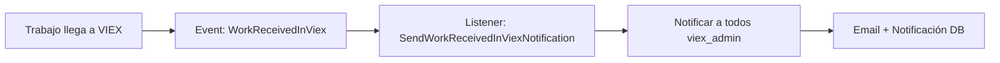
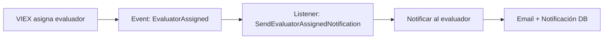
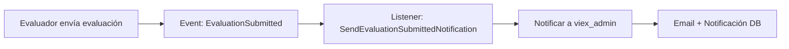
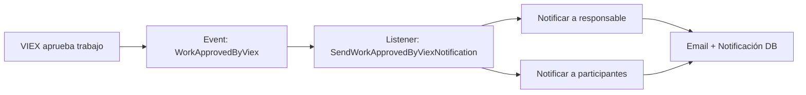
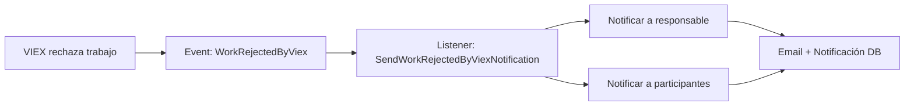

# Sistema de Notificaciones - VIEX (CU9)

## Descripción General

El sistema de notificaciones para el flujo de evaluación VIEX (CU9) gestiona la comunicación automatizada entre:
- Administradores VIEX
- Evaluadores asignados
- Profesores responsables de trabajos

## Arquitectura

### Componentes Implementados

#### 1. Events (5)
Los eventos se disparan cuando ocurren acciones importantes en el flujo:

- **`WorkReceivedInViex`**: Cuando un trabajo llega a VIEX desde Decano/Director
- **`EvaluatorAssigned`**: Cuando se asigna un evaluador a un trabajo
- **`EvaluationSubmitted`**: Cuando un evaluador completa y envía su evaluación
- **`WorkApprovedByViex`**: Cuando VIEX aprueba finalmente un trabajo
- **`WorkRejectedByViex`**: Cuando VIEX rechaza un trabajo

#### 2. Listeners (5)
Cada listener escucha un evento y ejecuta la lógica de notificación:

- **`SendWorkReceivedInViexNotification`**: Notifica a todos los administradores VIEX
- **`SendEvaluatorAssignedNotification`**: Notifica al evaluador asignado
- **`SendEvaluationSubmittedNotification`**: Notifica a administradores VIEX
- **`SendWorkApprovedByViexNotification`**: Notifica al profesor y participantes
- **`SendWorkRejectedByViexNotification`**: Notifica al profesor y participantes

Todos los listeners implementan `ShouldQueue` para ejecución asíncrona.

#### 3. Notifications (5)
Las notificaciones generan los mensajes y se envían por múltiples canales:

- **Canales**: `mail` + `database`
- **Características**:
  - Colas para envío asíncrono
  - Manejo de errores con logging
  - Plantillas de correo profesionales
  - Datos contextuales completos

#### 4. Integración en Controladores

**ViexController**:
```php
// Al recibir trabajo
event(new WorkReceivedInViex($work, Auth::user()));

// Al asignar evaluador
event(new EvaluatorAssigned($work, $workEvaluator, Auth::user()));

// Al aprobar trabajo
event(new WorkApprovedByViex($work, Auth::user(), $comments));

// Al rechazar trabajo
event(new WorkRejectedByViex($work, Auth::user(), $reason));
```

**EvaluatorController**:
```php
// Al enviar evaluación
event(new EvaluationSubmitted($work, $evaluation));
```

## Configuración

### 1. Variables de Entorno

Para **desarrollo** (usando log driver):
```env
MAIL_MAILER=log
MAIL_FROM_ADDRESS=viex@unp.edu.pa
MAIL_FROM_NAME="VIEX - Universidad de Panamá"
```

Para **producción** (usando SMTP):
```env
MAIL_MAILER=smtp
MAIL_HOST=smtp.unp.edu.pa
MAIL_PORT=587
MAIL_USERNAME=tu_usuario
MAIL_PASSWORD=tu_contraseña
MAIL_ENCRYPTION=tls
MAIL_FROM_ADDRESS=viex@unp.edu.pa
MAIL_FROM_NAME="VIEX - Universidad de Panamá"
```

### 2. Configuración de Colas

Para producción, es **obligatorio** usar un queue driver real (no `sync`):

```env
QUEUE_CONNECTION=database
```

Ejecutar el worker:
```bash
php artisan queue:work --tries=3 --timeout=90
```

Para supervisar con Supervisor (recomendado):
```ini
[program:viex-worker]
process_name=%(program_name)s_%(process_num)02d
command=php /ruta/a/viex/artisan queue:work database --sleep=3 --tries=3 --max-time=3600
autostart=true
autorestart=true
stopasgroup=true
killasgroup=true
user=www-data
numprocs=2
redirect_stderr=true
stdout_logfile=/ruta/a/viex/storage/logs/worker.log
stopwaitsecs=3600
```

### 3. Migración de Tabla de Notificaciones

La tabla `notifications` ya está creada. Para verificar:
```bash
php artisan migrate:status
```

### 4. Configuración de Usuarios

Asegurarse de que los usuarios tengan:
- **Email válido** en el campo `email`
- **Roles correctos** asignados (viex_admin, evaluador, profesor)

## Flujo de Notificaciones

### Flujo 1: Recepción de Trabajo en VIEX



**Destinatarios**: Todos los usuarios con rol `viex_admin`

**Contenido**:
- Título del trabajo
- Tipo de trabajo
- Responsable
- Unidad organizativa
- Enlace directo al trabajo

### Flujo 2: Asignación de Evaluador



**Destinatarios**: El evaluador asignado

**Contenido**:
- Información del trabajo
- Rol asignado (principal o regular)
- Notas de asignación
- Quién hizo la asignación
- Enlace para aceptar/declinar

### Flujo 3: Evaluación Enviada



**Destinatarios**: Todos los usuarios con rol `viex_admin`

**Contenido**:
- Nombre del evaluador
- Puntuaciones obtenidas
- Decisión recomendada
- Enlace para revisar evaluaciones

### Flujo 4: Aprobación por VIEX



**Destinatarios**: 
- Profesor responsable
- Todos los participantes del trabajo

**Contenido**:
- Confirmación de aprobación
- Resumen de evaluaciones
- Puntuación promedio
- Comentarios de VIEX
- Próximos pasos (certificación)

### Flujo 5: Rechazo por VIEX



**Destinatarios**: 
- Profesor responsable
- Todos los participantes del trabajo

**Contenido**:
- Motivo del rechazo
- Resumen de evaluaciones
- Recomendaciones
- Opción de corregir y reenviar

## Pruebas

### 1. Prueba Manual (Desarrollo)

Con `MAIL_MAILER=log`, los correos se guardan en:
```
storage/logs/laravel.log
```

Ejemplo de prueba:
```bash
php artisan tinker

# Simular asignación de evaluador
$work = App\Models\WorkOfExtension::find(1);
$evaluator = App\Models\User::role('evaluador')->first();
$admin = App\Models\User::role('viex_admin')->first();

$workEvaluator = $work->assignEvaluator($evaluator, $admin, 'lead_evaluator', 'Notas de prueba');
event(new App\Events\EvaluatorAssigned($work, $workEvaluator, $admin));

# Verificar en logs
tail -f storage/logs/laravel.log
```

### 2. Verificar Notificaciones en Base de Datos

```sql
SELECT * FROM notifications WHERE notifiable_type = 'App\\Models\\User' ORDER BY created_at DESC;
```

### 3. Probar Envío de Correos Reales

```bash
php artisan tinker

$user = App\Models\User::find(1);
$user->notify(new App\Notifications\EvaluatorAssignedNotification($work, $workEvaluator, $admin));
```

## Monitoreo

### Comandos Útiles

**Ver trabajos en cola**:
```bash
php artisan queue:monitor
```

**Ver trabajos fallidos**:
```bash
php artisan queue:failed
```

**Reintentar trabajos fallidos**:
```bash
php artisan queue:retry all
```

**Limpiar trabajos fallidos**:
```bash
php artisan queue:flush
```

### Logs de Errores

Los errores de notificaciones se registran en:
- `storage/logs/laravel.log`

Cada listener tiene manejo de errores:
```php
public function failed(Event $event, \Throwable $exception): void
{
    Log::error('Failed to send notification', [
        'work_id' => $event->work->id,
        'exception' => $exception->getMessage(),
    ]);
}
```

## Personalización

### Modificar Plantillas de Correo

Las notificaciones usan el método `toMail()`:
```php
public function toMail(object $notifiable): MailMessage
{
    return (new MailMessage())
        ->subject(__('Asunto del correo'))
        ->greeting(__('¡Hola :name!', ['name' => $notifiable->first_name]))
        ->line(__('Contenido...'))
        ->action(__('Botón de acción'), route('ruta.nombre'))
        ->line(__('Más contenido...'));
}
```

Para cambiar el diseño global, publicar las vistas de mail:
```bash
php artisan vendor:publish --tag=laravel-mail
```

Editar: `resources/views/vendor/mail/html/themes/default.css`

### Agregar Canales Adicionales

Para agregar notificaciones Slack, SMS, etc.:

1. Instalar el canal correspondiente
2. Agregar el canal al método `via()`:
```php
public function via(object $notifiable): array
{
    return ['mail', 'database', 'slack'];
}
```

3. Implementar el método `toSlack()`, `toSms()`, etc.

## Mejores Prácticas

1. **Siempre usar colas** en producción (nunca `sync`)
2. **Monitorear queue workers** con Supervisor
3. **Configurar timeout** adecuado para workers
4. **Implementar retry logic** para fallos transitorios
5. **Logging completo** de errores de notificaciones
6. **Validar emails** antes de registrar usuarios
7. **Rate limiting** en producción para evitar spam
8. **Testing exhaustivo** antes de producción

## Solución de Problemas

### Problema: Notificaciones no se envían

**Causa 1**: Queue worker no está corriendo
```bash
# Solución
php artisan queue:work
```

**Causa 2**: Email inválido del usuario
```sql
-- Verificar
SELECT id, email FROM users WHERE email IS NULL OR email = '';
```

**Causa 3**: Error en configuración SMTP
```bash
# Probar conexión
php artisan tinker
Mail::raw('Test', function($message) { $message->to('test@example.com')->subject('Test'); });
```

### Problema: Colas se llenan

**Causa**: Demasiadas notificaciones fallidas

**Solución**:
```bash
# Ver fallidos
php artisan queue:failed

# Limpiar fallidos
php artisan queue:flush

# Revisar logs
tail -f storage/logs/laravel.log
```

### Problema: Correos no llegan

**Causa 1**: Firewall bloqueando puerto SMTP
**Causa 2**: Credenciales SMTP incorrectas
**Causa 3**: Correos marcados como spam

**Solución**: 
- Verificar configuración SPF/DKIM
- Usar servicio de email transaccional (SendGrid, Mailgun, etc.)
- Revisar logs del servidor SMTP

## Comandos Artisan Personalizados (Futuro)

Para administración avanzada, considerar crear:

```bash
# Enviar notificación de prueba
php artisan viex:test-notification {user_id} {type}

# Reenviar notificaciones fallidas de un trabajo
php artisan viex:retry-notifications {work_id}

# Generar reporte de notificaciones
php artisan viex:notification-report {start_date} {end_date}
```

## Referencias

- [Laravel Notifications](https://laravel.com/docs/11.x/notifications)
- [Laravel Queues](https://laravel.com/docs/11.x/queues)
- [Laravel Events](https://laravel.com/docs/11.x/events)
- [Laravel Mail](https://laravel.com/docs/11.x/mail)
