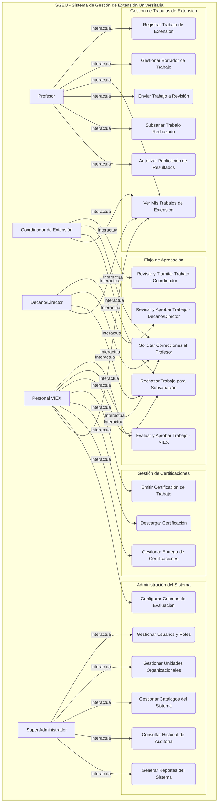
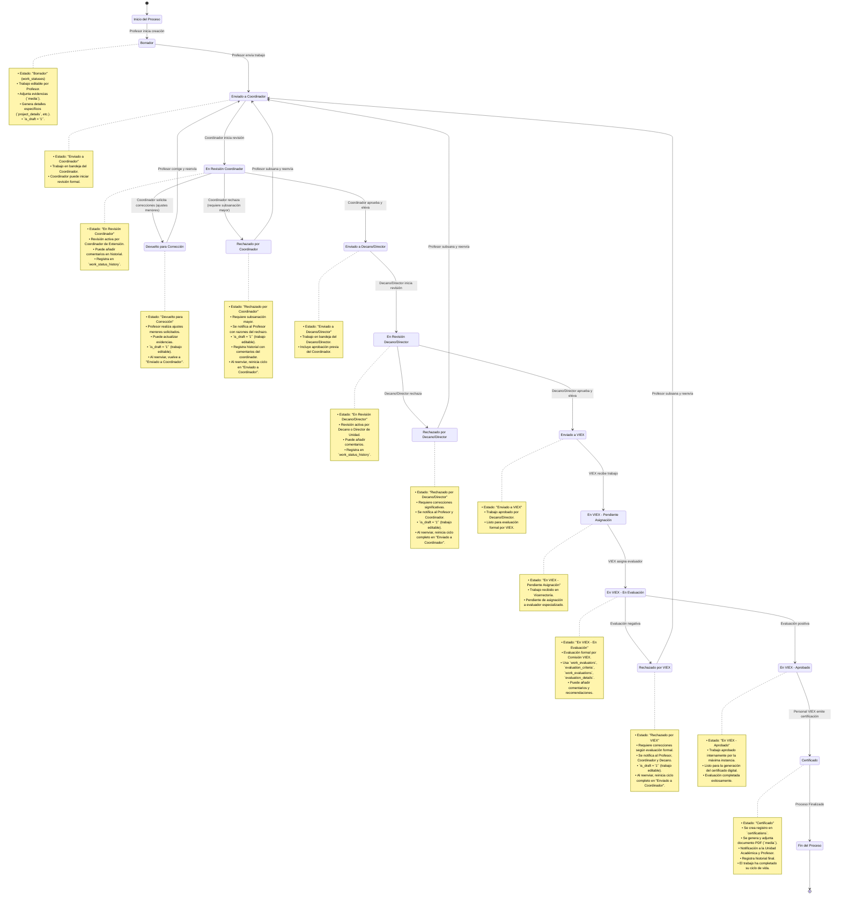

# **Modelo de Casos de Uso (CU) - Sistema de Gestión de Extensión Universitaria (SGEU)**

**Versión:** 1.0
**Fecha:** 6 de octubre de 2025
**Sistema:** SGEU - Plataforma de Registro y Certificación de Trabajos de Extensión

## **🎯 Objetivo**

Este documento describe los casos de uso principales del Sistema de Gestión de Extensión Universitaria (SGEU), detallando las interacciones entre los actores y el sistema para cumplir con los requisitos funcionales del "Manual de Procedimientos Para Presentar Trabajos de Extensión".

## **👥 Actores del Sistema**

Los principales actores que interactuarán con el SGEU son:

*   **Profesor:** Docente de la Universidad de Panamá que crea, gestiona, edita y envía sus Trabajos de Extensión.
*   **Coordinador de Extensión (Unidad Académica):** Responsable de una Unidad Académica (Departamento/Escuela) que revisa y tramita los Trabajos de Extensión enviados por los profesores de su unidad.
*   **Decano/Director (Unidad Académica):** Decano de Facultad, Director de Centro Regional o Coordinador de Extensión Universitaria que revisa y aprueba los Trabajos de Extensión de su facultad/centro.
*   **Personal VIEX (Comisión y Administrativos):** Personal de la Vicerrectoría de Extensión encargado de la evaluación final, registro, certificación y administración del sistema. Este actor puede subdividirse en:
    *   **Evaluador VIEX:** Personal asignado para evaluar formalmente los trabajos.
    *   **Administrativo VIEX:** Personal que emite certificaciones y gestiona configuraciones.
*   **Super Administrador:** Usuario con control total sobre el sistema, encargado de la configuración global, gestión de usuarios y roles, y auditoría.

## ** diagrama general de casos de uso**

## Flujo de Estados de un Trabajo de Extensión

## **📋 Descripciones Detalladas de Casos de Uso**

### **Módulo: Gestión de Trabajos de Extensión**

#### **CU1: Registrar Trabajo de Extensión** ****
*   **Actor Principal:** Profesor
*   **Precondiciones:** El Profesor ha iniciado sesión.
*   **Flujo Principal:**
    1.  El Profesor accede a la opción "Registrar Nuevo Trabajo de Extensión".
    2.  El sistema presenta un formulario guiado donde el Profesor selecciona el tipo de trabajo (Proyecto, Actividad, Publicación, Asistencia Técnica).
    3.  El formulario se adapta dinámicamente para mostrar los campos generales y específicos requeridos para el tipo seleccionado (ej. `project_details`, `activity_details`).
    4.  El Profesor completa todos los campos obligatorios del formulario.
    5.  El Profesor adjunta las evidencias necesarias utilizando el gestor de archivos (`MediaLibrary`).
    6.  El Profesor puede guardar el trabajo como borrador (`is_draft = TRUE`).
    7.  El sistema valida los datos y guarda el trabajo, asignándole el estado "Borrador".
*   **Postcondiciones:** El Trabajo de Extensión se guarda como borrador y está listo para ser editado o enviado a revisión.
*   **Reglas de Negocio:**
    *   Todos los campos obligatorios deben estar completados.
    *   Los archivos adjuntos deben cumplir con las validaciones de tipo y tamaño.
    *   Los campos específicos del tipo de trabajo deben ser consistentes con el manual.

#### **CU2: Gestionar Borrador de Trabajo**
*   **Actor Principal:** Profesor
*   **Precondiciones:** El Profesor ha iniciado sesión y tiene Trabajos de Extensión en estado "Borrador".
*   **Flujo Principal:**
    1.  El Profesor accede a la lista de sus Trabajos de Extensión.
    2.  Selecciona un trabajo en estado "Borrador" para editar.
    3.  El sistema carga el formulario con los datos previamente guardados.
    4.  El Profesor modifica los campos necesarios o gestiona los archivos adjuntos.
    5.  El Profesor guarda los cambios.
    6.  El sistema valida los datos y actualiza el trabajo.
*   **Postcondiciones:** El Trabajo de Extensión en borrador ha sido actualizado.

#### **CU3: Ver Mis Trabajos de Extensión**
*   **Actores:** Profesor, Coordinador de Extensión, Decano/Director, Personal VIEX (todos los actores).
*   **Precondiciones:** El Actor ha iniciado sesión.
*   **Flujo Principal:**
    1.  El Actor accede a su panel o a la sección "Mis Trabajos de Extensión" / "Trabajos de Mi Unidad/Facultad" / "Todos los Trabajos".
    2.  El sistema muestra una lista de Trabajos de Extensión relevantes para el Actor, con su estado actual y detalles clave.
    3.  El Actor puede aplicar filtros (por estado, tipo, unidad, etc.) y buscar trabajos.
    4.  El Actor selecciona un trabajo para ver sus detalles completos (formulario, historial de estados, comentarios, evidencias, participantes).
*   **Postcondiciones:** El Actor ha visualizado la información de los Trabajos de Extensión.
*   **Reglas de Negocio:**
    *   Los profesores solo pueden ver sus propios trabajos.
    *   Los coordinadores ven los trabajos de su unidad académica.
    *   Los decanos/directores ven los trabajos de su facultad/centro regional.
    *   El personal VIEX (y Super Administrador) puede ver todos los trabajos.

#### **CU4: Enviar Trabajo a Revisión**
*   **Actor Principal:** Profesor
*   **Precondiciones:** El Profesor tiene un Trabajo de Extensión en estado "Borrador" y ha completado todos los requisitos.
*   **Flujo Principal:**
    1.  El Profesor selecciona un trabajo en estado "Borrador".
    2.  Selecciona la opción "Enviar a Revisión".
    3.  El sistema realiza una validación final de que todos los campos requeridos estén completos y las evidencias adjuntas.
    4.  El sistema cambia el estado del trabajo a "Pendiente Revisión (Coordinación)".
    5.  El sistema registra la transición en el `work_status_history`.
    6.  El sistema envía una notificación al Coordinador de Extensión de la unidad académica correspondiente.
*   **Postcondiciones:** El Trabajo de Extensión está en revisión y el Coordinador de Extensión ha sido notificado.
*   **Reglas de Negocio:**
    *   Solo los trabajos en estado "Borrador" pueden ser enviados a revisión.
    *   Todos los requisitos del manual deben cumplirse antes del envío.

#### **CU5: Subsanar Trabajo Rechazado**
*   **Actor Principal:** Profesor
*   **Precondiciones:** El Profesor tiene un Trabajo de Extensión en estado **"Devuelto para Corrección"**, **"Rechazado por Coordinador"**, **"Rechazado por Decano/Director"** o **"Rechazado por VIEX"**.
*   **Flujo Principal:**
    1.  El Profesor accede a la lista de sus Trabajos de Extensión.
    2.  Selecciona un trabajo en estado rechazado o devuelto para corrección.
    3.  El sistema muestra el trabajo con los comentarios de rechazo/corrección de la última instancia revisora.
    4.  El Profesor edita el trabajo para aplicar las subsanaciones o correcciones requeridas (el sistema permite edición porque `is_draft = '1'`).
    5.  El Profesor puede actualizar campos, adjuntar nuevas evidencias, o modificar la información según los comentarios recibidos.
    6.  El Profesor guarda los cambios.
    7.  El Profesor selecciona la opción "Reenviar a Revisión".
    8.  El sistema valida que todos los campos requeridos estén completos.
    9.  El sistema cambia el estado del trabajo a **"Enviado a Coordinador"**.
    10. El sistema establece `is_draft = '0'` (ya no es borrador editable).
    11. El sistema registra la transición en el `work_status_history` indicando que el profesor reenviado tras correcciones.
    12. El sistema envía una notificación al Coordinador de Extensión informando del reenvío.
*   **Postcondiciones:** El Trabajo de Extensión subsanado vuelve al inicio del flujo de aprobación con estado **"Enviado a Coordinador"**, reiniciando el ciclo de revisión.
*   **Nota Técnica:** Independientemente del nivel que rechazó el trabajo (Coordinador, Decano o VIEX), al reenviar siempre vuelve al estado **"Enviado a Coordinador"** para reiniciar el flujo completo de aprobación.

#### **CU6: Autorizar Publicación de Resultados**
*   **Actor Principal:** Profesor
*   **Precondiciones:** El Profesor tiene un Trabajo de Extensión.
*   **Flujo Principal:**
    1.  El Profesor selecciona un Trabajo de Extensión para el cual desea autorizar la publicación.
    2.  Selecciona la opción "Autorizar Publicación".
    3.  El sistema presenta una confirmación sobre la autorización.
    4.  El Profesor confirma su decisión.
    5.  El sistema registra el consentimiento de publicación (`publication_consent = TRUE`) en el trabajo.
    6.  El sistema envía una notificación al correo electrónico `viexproyectos@up.ac.pa`.
*   **Postcondiciones:** El consentimiento de publicación está registrado en el sistema.

### **Módulo: Flujo de Aprobación**

#### **CU7: Revisar y Tramitar Trabajo - Coordinador**
*   **Actor Principal:** Coordinador de Extensión
*   **Precondiciones:** El Coordinador de Extensión ha iniciado sesión y tiene Trabajos de Extensión en estado **"Enviado a Coordinador"** o **"En Revisión Coordinador"**.
*   **Flujo Principal:**
    1.  El Coordinador de Extensión accede a su bandeja de trabajos pendientes.
    2.  Selecciona un Trabajo de Extensión para revisión.
    3.  (Opcional) Si el trabajo está en "Enviado a Coordinador", puede cambiar su estado a **"En Revisión Coordinador"** para indicar que inició la revisión formal.
    4.  El sistema muestra el formulario completo del trabajo, evidencias, historial y comentarios.
    5.  El Coordinador revisa el trabajo.
    6.  Si el trabajo cumple con los requisitos iniciales, el Coordinador selecciona "Aprobar y Enviar al Decano/Director".
    7.  El sistema cambia el estado del trabajo a **"Enviado a Decano/Director"**.
    8.  El sistema registra la transición en el `work_status_history` y envía una notificación al Decano/Director y al Profesor.
*   **Flujos Alternos:**
    *   **CU10: Solicitar Correcciones al Profesor:** El Coordinador puede solicitar ajustes menores (cambia a **"Devuelto para Corrección"**). El profesor podrá editar y reenviar el trabajo.
    *   **CU11: Rechazar Trabajo para Subsanación:** El Coordinador puede rechazar el trabajo si requiere cambios significativos (cambia a **"Rechazado por Coordinador"**). El profesor deberá realizar subsanaciones mayores antes de reenviar.
*   **Postcondiciones:** El Trabajo de Extensión avanza al siguiente nivel de revisión o es devuelto para correcciones/subsanación.
*   **Nota Técnica:** Los nombres de estados entre comillas dobles corresponden exactamente a los valores en la tabla `work_statuses` de la base de datos. Los trabajos rechazados o devueltos establecen `is_draft = '1'` para permitir la edición por parte del profesor.

#### **CU8: Revisar y Aprobar Trabajo - Decano/Director**
*   **Actor Principal:** Decano/Director
*   **Precondiciones:** El Decano/Director ha iniciado sesión y tiene Trabajos de Extensión en estado **"Enviado a Decano/Director"** o **"En Revisión Decano/Director"**.
*   **Flujo Principal:**
    1.  El Decano/Director accede a su bandeja de trabajos pendientes.
    2.  Selecciona un Trabajo de Extensión para revisión.
    3.  (Opcional) Si el trabajo está en "Enviado a Decano/Director", puede cambiar su estado a **"En Revisión Decano/Director"** para indicar que inició la revisión formal.
    4.  El sistema muestra el formulario completo, evidencias, historial de revisiones previas y comentarios.
    5.  El Decano/Director revisa el trabajo.
    6.  Si el trabajo cumple con los requisitos, el Decano/Director selecciona "Aprobar y Elevar a VIEX".
    7.  El sistema cambia el estado del trabajo a **"Enviado a VIEX"**.
    8.  El sistema registra la transición en el `work_status_history` y envía una notificación al Personal VIEX y al Profesor.
*   **Flujos Alternos:**
    *   **CU11: Rechazar Trabajo para Subsanación:** El Decano/Director puede rechazar el trabajo (cambia a **"Rechazado por Decano/Director"**). El profesor deberá realizar correcciones significativas antes de reenviar.
*   **Postcondiciones:** El Trabajo de Extensión avanza al siguiente nivel de revisión o es devuelto para correcciones/subsanación.
*   **Nota Técnica:** Los nombres de estados entre comillas dobles corresponden exactamente a los valores en la tabla `work_statuses` de la base de datos.

#### **CU9: Evaluar y Aprobar Trabajo - VIEX**
*   **Actor Principal:** Personal VIEX (Evaluador VIEX)
*   **Precondiciones:** El Personal VIEX ha iniciado sesión y tiene Trabajos de Extensión en estado **"Enviado a VIEX"**, **"En VIEX - Pendiente Asignación"** o **"En VIEX - En Evaluación"**.
*   **Flujo Principal:**
    1.  El Personal VIEX accede a su bandeja de trabajos pendientes.
    2.  Selecciona un Trabajo de Extensión para evaluación.
    3.  Si está en "Enviado a VIEX", el sistema lo cambia a **"En VIEX - Pendiente Asignación"**.
    4.  El sistema muestra todos los detalles del trabajo y el historial de revisiones.
    5.  El Personal VIEX asigna evaluadores al trabajo (mediante `work_evaluators`).
    6.  El sistema cambia el estado a **"En VIEX - En Evaluación"**.
    7.  Los evaluadores completan la evaluación utilizando los `evaluation_criteria`, registrando `work_evaluations` y `evaluation_details`.
    8.  El Personal VIEX (o la Comisión VIEX) revisa las evaluaciones y toma una decisión final.
    9.  Si la evaluación es positiva, el Personal VIEX selecciona "Aprobar Evaluación".
    10. El sistema cambia el estado del trabajo a **"En VIEX - Aprobado"**.
    11. El sistema registra la transición en el `work_status_history` y envía una notificación al Profesor.
*   **Flujos Alternos:**
    *   **CU11: Rechazar Trabajo para Subsanación:** El Personal VIEX puede rechazar el trabajo si requiere cambios significativos tras la evaluación (cambia a **"Rechazado por VIEX"**). El profesor deberá realizar correcciones antes de reenviar.
*   **Postcondiciones:** El Trabajo de Extensión está internamente aprobado por VIEX, listo para la certificación oficial, o es devuelto para correcciones/subsanación.
*   **Nota Técnica:** Los nombres de estados entre comillas dobles corresponden exactamente a los valores en la tabla `work_statuses` de la base de datos.

#### **CU10: Solicitar Correcciones al Profesor**
*   **Actores:** Coordinador de Extensión.
*   **Precondiciones:** El Actor está revisando un Trabajo de Extensión en estado **"En Revisión Coordinador"**.
*   **Flujo Principal:**
    1.  El Coordinador identifica ajustes menores o aclaraciones necesarias en el trabajo.
    2.  El Coordinador selecciona la opción "Solicitar Correcciones".
    3.  El sistema solicita al Coordinador que ingrese comentarios detallados sobre las correcciones requeridas.
    4.  El sistema cambia el estado del trabajo a **"Devuelto para Corrección"**.
    5.  El sistema establece `is_draft = '1'` para permitir la edición por parte del profesor.
    6.  El sistema registra la transición en el `work_status_history` incluyendo los comentarios del coordinador.
    7.  El sistema envía una notificación al Profesor con los comentarios y las correcciones solicitadas.
*   **Postcondiciones:** El Trabajo de Extensión espera ajustes menores por parte del Profesor. El profesor puede editar y reenviar el trabajo.
*   **Nota Técnica:** Este caso de uso aplica para **ajustes menores**. Para cambios significativos, usar **CU11: Rechazar Trabajo para Subsanación**.

#### **CU11: Rechazar Trabajo para Subsanación**
*   **Actores:** Coordinador de Extensión, Decano/Director, Personal VIEX.
*   **Precondiciones:** El Actor está revisando/evaluando un Trabajo de Extensión.
*   **Flujo Principal:**
    1.  El Actor identifica problemas significativos o incumplimientos graves en el trabajo que requieren una subsanación mayor.
    2.  El Actor selecciona la opción "Rechazar Trabajo".
    3.  El sistema solicita al Actor que ingrese comentarios detallados sobre las razones del rechazo.
    4.  El sistema cambia el estado del trabajo según el actor:
        *   Coordinador → **"Rechazado por Coordinador"**
        *   Decano/Director → **"Rechazado por Decano/Director"**
        *   Personal VIEX → **"Rechazado por VIEX"**
    5.  El sistema establece `is_draft = '1'` para permitir la edición por parte del profesor.
    6.  El sistema registra la transición en el `work_status_history` incluyendo los comentarios del evaluador.
    7.  El sistema envía una notificación al Profesor con las razones del rechazo.
    8.  Si el rechazo es por Decano/Director o VIEX, también se notifica al Coordinador de Extensión.
*   **Postcondiciones:** El Trabajo de Extensión regresa al Profesor para subsanación mayor. Al reenviar, el trabajo reinicia el ciclo de revisión desde el estado **"Enviado a Coordinador"**.
#### **CU12: Emitir Certificación de Trabajo**
*   **Actor Principal:** Personal VIEX (Administrativo VIEX)
*   **Precondiciones:** El Personal VIEX tiene Trabajos de Extensión en estado **"En VIEX - Aprobado"**.
*   **Flujo Principal:**
    1.  El Personal VIEX accede a la bandeja de trabajos "Listos para Certificar".
    2.  Selecciona uno o varios trabajos en estado **"En VIEX - Aprobado"**.
    3.  Selecciona la opción "Emitir Certificación".
    4.  El sistema genera un número de certificación único.
    5.  El sistema dispara un Job (`GenerateCertificationPDF`) para generar el documento PDF oficial de la certificación.
    6.  El sistema registra la certificación en la tabla `certifications`, asociándola al trabajo y al archivo PDF generado (`media`).
    7.  El sistema cambia el estado del trabajo a **"Certificado"**.
    8.  El sistema registra la transición en el `work_status_history` y envía una notificación al Profesor y al Coordinador de Extensión.
*   **Postcondiciones:** El Trabajo de Extensión ha sido certificado oficialmente y el documento está disponible para descarga.
*   **Nota Técnica:** El estado **"Certificado"** es el estado final del ciclo de vida de un trabajo de extensión.icación.
    6.  El sistema registra la certificación en la tabla `certifications`, asociándola al trabajo y al archivo PDF generado (`media`).
    7.  El sistema cambia el estado del trabajo a "Trabajo Certificado".
    8.  El sistema registra la transición en el `work_status_history` y envía una notificación al Profesor y al Coordinador de Extensión.
*   **Postcondiciones:** El Trabajo de Extensión ha sido certificado oficialmente y el documento está disponible.
#### **CU13: Descargar Certificación**
*   **Actores:** Profesor, Coordinador de Extensión, Decano/Director, Personal VIEX (todos los actores autorizados).
*   **Precondiciones:** El Trabajo de Extensión está en estado **"Certificado"** y el Actor tiene los permisos para descargarla.
*   **Flujo Principal:**
    1.  El Actor visualiza un Trabajo de Extensión certificado.
    2.  El sistema muestra la información de la certificación y un enlace de descarga.
    3.  El Actor selecciona el enlace para descargar el PDF de la certificación.
    4.  El sistema proporciona el archivo PDF generado desde la tabla `certifications` y almacenado en `media`.
*   **Postcondiciones:** El Actor ha descargado la certificación oficial.
*   **Reglas de Negocio:**
    *   Solo los usuarios con permisos específicos pueden descargar certificaciones (ej. Profesor de su trabajo, Coordinador de su unidad, Personal VIEX de todos).
*   **Nota Técnica:** Solo los trabajos en estado **"Certificado"** tienen un PDF de certificación disponible en la colección de media.
    *   Solo los usuarios con permisos específicos pueden descargar certificaciones (ej. Profesor de su trabajo, Coordinador de su unidad, Personal VIEX de todos).

#### **CU14: Gestionar Entrega de Certificaciones**
*   **Actor Principal:** Coordinador de Extensión
*   **Precondiciones:** El Coordinador de Extensión tiene certificaciones "Disponibles" para su unidad académica.
*   **Flujo Principal:**
    1.  El Coordinador de Extensión accede a la lista de certificaciones de su unidad.
    2.  El sistema muestra las certificaciones con su estado de entrega (`delivery_status`).
    3.  Cuando una certificación ha sido entregada al profesor, el Coordinador selecciona la opción "Marcar como Entregada".
    4.  El sistema actualiza el `delivery_status` de la certificación a "Entregada".
    5.  El sistema registra la acción de entrega.
*   **Postcondiciones:** El estado de entrega de la certificación se ha actualizado.

### **Módulo: Administración del Sistema**

#### **CU15: Gestionar Usuarios y Roles**
*   **Actor Principal:** Super Administrador
*   **Precondiciones:** El Super Administrador ha iniciado sesión.
*   **Flujo Principal:**
    1.  El Super Administrador accede al panel de "Gestión de Usuarios".
    2.  Puede crear, editar o eliminar usuarios del sistema.
    3.  Puede asignar o revocar roles (profesor, coordinador, decano, viex_admin, super_admin) y permisos a los usuarios.
    4.  Puede activar o desactivar cuentas de usuario.
*   **Postcondiciones:** Los usuarios y sus roles/permisos en el sistema han sido gestionados.

#### **CU16: Gestionar Unidades Organizacionales**
*   **Actor Principal:** Super Administrador
*   **Precondiciones:** El Super Administrador ha iniciado sesión.
*   **Flujo Principal:**
    1.  El Super Administrador accede al panel de "Gestión de Unidades Organizacionales".
    2.  Puede crear, editar o eliminar Sedes, Facultades, Departamentos y Escuelas.
    3.  Puede establecer la jerarquía entre estas unidades.
*   **Postcondiciones:** La estructura organizacional de la Universidad en el sistema ha sido gestionada.

#### **CU17: Gestionar Catálogos del Sistema**
*   **Actor Principal:** Super Administrador, Personal VIEX (Administrativo VIEX).
*   **Precondiciones:** El Actor tiene los permisos adecuados y ha iniciado sesión.
*   **Flujo Principal:**
    1.  El Actor accede al panel de "Gestión de Catálogos".
    2.  Puede gestionar los valores de los catálogos del sistema:
        *   Tipos de Trabajo (`work_type`).
        *   Estados de Trabajo (`work_statuses`).
        *   Tipos de Proyectos Institucionales (`institutional_project_types`).
    3.  Puede añadir, editar o desactivar elementos en estos catálogos.
*   **Postcondiciones:** Los valores de los catálogos del sistema han sido gestionados.

#### **CU18: Configurar Criterios de Evaluación**
*   **Actor Principal:** Personal VIEX (Administrativo VIEX)
*   **Precondiciones:** El Personal VIEX ha iniciado sesión.
*   **Flujo Principal:**
    1.  El Personal VIEX accede al panel de "Configuración de Criterios de Evaluación".
    2.  Puede crear, editar o desactivar `evaluation_criteria`.
    3.  Puede ajustar el `weight` (peso) de cada criterio y su `display_order`.
    4.  El sistema valida que la suma de los pesos de los criterios activos sea 100%.
*   **Postcondiciones:** Los criterios de evaluación del sistema han sido configurados.

#### **CU19: Consultar Historial de Auditoría**
*   **Actor Principal:** Super Administrador
*   **Precondiciones:** El Super Administrador ha iniciado sesión.
*   **Flujo Principal:**
    1.  El Super Administrador accede al panel de "Auditoría del Sistema".
    2.  El sistema muestra un registro detallado de todas las acciones auditadas (`audits`).
    3.  El Super Administrador puede filtrar los registros por usuario, evento, modelo afectado y fecha.
    4.  El Super Administrador puede ver los `old_values` y `new_values` de los cambios.
*   **Postcondiciones:** El Super Administrador ha consultado la actividad del sistema.

#### **CU20: Generar Reportes del Sistema**
*   **Actores:** Super Administrador, Personal VIEX (Administrativo VIEX).
*   **Precondiciones:** El Actor tiene los permisos adecuados y ha iniciado sesión.
*   **Flujo Principal:**
    1.  El Actor accede al panel de "Generación de Reportes".
    2.  El sistema presenta una lista de reportes disponibles (ej. "Trabajos por estado", "Trabajos por unidad académica", "Estadísticas de evaluación").
    3.  El Actor selecciona un reporte y especifica los parámetros (fechas, filtros).
    4.  El sistema genera el reporte solicitado y lo muestra en pantalla o permite su descarga (ej. PDF, CSV).
*   **Postcondiciones:** El Actor ha generado y visualizado/descargado un reporte del sistema.

---¡Excelente! El prompt tiene personalidad y un objetivo claro. Aquí tienes una versión mejorada que es más específica, estructurada y elimina ambigüedades para obtener un análisis más completo y útil.

---

### Prompt Mejorado:

**Tu Misión (¡Esperamos que aceptes!):**

Actúa como un ingeniero de calidad senior y arquitecto de software. Tu tarea es realizar una auditoría integral del código de nuestro proyecto para verificar el cumplimiento de los casos de uso especificados en `doc/sega/CU.md`.

Sigue este procedimiento estructurado para tu análisis:

**1. Análisis de Comprensión:**
   - Primero, lee y analiza el documento `doc/sega/CU.md` para entender todos los casos de uso, sus flujos principales, alternativos y los criterios de aceptación.
   - Luego, explora la estructura del proyecto para familiarizarte con los componentes clave (ej. controladores, servicios, modelos, utils).

**2. Verificación y Mapeo:**
   - Para **cada caso de uso** en el documento, identifica y traza (o "mapea") las funciones, componentes y módulos específicos en el código que se encargan de implementarlo.
   - Verifica que **todos** los criterios de aceptación y flujos (principal y alternativos) estén implementados en el código. Por ejemplo: "Para el CU-001 'Login de Usuario', la función `authService.login()` maneja el flujo principal, pero no se encuentra el manejo del flujo alternativo 'contraseña incorrecta'".

**3. Reporte de Hallazgos:**
   - Proporciona un resumen ejecutivo al final.
   - Genera una tabla detallada con los siguientes campos para cada caso de uso:
     - **ID del CU** (ej. CU-001)
     - **Nombre del CU**
     - **Estado de Cumplimiento**: (✅ Cumplido / ⚠️ Parcialmente / ❌ No Encontrado / 🔍 Necesita Revisión)
     - **Componentes/Archivos Asociados**: (Lista los archivos y funciones principales que lo implementan)
     - **Evidencia/Problemas Identificados**: (Describe *qué* se implementa correctamente y, si es necesario, *dónde* falla o falta lógica, citando código específico si es posible).
     - **Recomendación**: (Acción concreta a tomar, ej. "Implementar función de validación de email", "Añadir manejo de excepción en el controlador X").

**Preguntas clave a responder en tu análisis:**
- ¿Está el código alineado con los flujos descritos en el documento?
- ¿Faltan implementaciones para algún flujo alternativo o validación?
- ¿Hay discrepancias entre la especificación y la implementación?

**Formato de Salida Esperado:**
Comienza con un resumen general y luego presenta la tabla detallada. Sé meticuloso y basado en evidencias.

---

### ¿Por qué este prompt es mejor?

1.  **Rol Definido:** "Ingeniero de calidad senior y arquitecto de software" establece una expectativa clara de expertise.
2.  **Proceso Estructurado:** Divide la tarea en pasos (Análisis, Verificación, Reporte), guiando el proceso de pensamiento de la IA.
3.  **Especificidad:** Pide explícitamente un mapeo entre los CUs y el código, y verifica flujos alternativos, no solo el principal.
4.  **Criterios de Éxito Claros:** Define un campo de "Estado de Cumplimiento" con opciones específicas, lo que facilita una evaluación rápida.
5.  **Enfoque en la Acción:** La columna "Recomendación" fuerza a la IA a ir más allá de señalar problemas y a proponer soluciones.
6.  **Preguntas Guía:** Incluye preguntas clave que enfocan el análisis en los aspectos más importantes.
7.  **Formato de Salida Explícito:** Indica exactamente cómo debe presentarse la información (resumen + tabla), haciendo el resultado más usable y profesional.

---

¡Excelente! El prompt tiene personalidad y un objetivo claro. Aquí tienes una versión mejorada que es más específica, estructurada y elimina ambigüedades para obtener un análisis más completo y útil.

---

