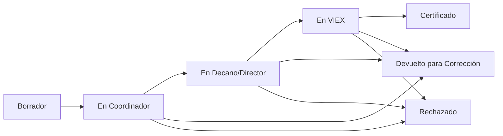

# 🚀 Guía de Inicio Rápido - VIEX

<div align="center">


**¡Bienvenido al Sistema VIEX!**
*En 5 minutos estarás listo para usar la plataforma*

</div>

## 🎯 ¿Qué es VIEX?

VIEX es la **plataforma digital** de la Universidad de Panamá para gestionar todos los **trabajos de extensión universitarios**. Reemplaza el proceso manual con formularios físicos por un sistema completamente digital.

### **¿Qué puedes hacer aquí?**
- ✅ **Registrar** trabajos de extensión (Proyectos, Actividades, Publicaciones, Asistencias Técnicas)
- ✅ **Gestionar** el proceso de aprobación desde tu unidad hasta VIEX
- ✅ **Certificar** trabajos para evaluación docente
- ✅ **Seguir** el estado de tus trabajos en tiempo real

---

## 🔐 Paso 1: Acceder al Sistema

### **🌐 URL del Sistema**
```
https://viex.up.ac.pa
```

### **🔑 Credenciales de Acceso**
- **Usuario**: Tu email institucional (@up.ac.pa)
- **Contraseña**: Proporcionada por tu coordinador o administrador

### **🎭 Tipos de Usuario**
| Rol | Función Principal |
|-----|-------------------|
| **👨‍🏫 Profesor** | Crear y gestionar trabajos de extensión |
| **👨‍💼 Coordinador** | Revisar trabajos de su unidad académica |
| **👨‍💻 Decano/Director** | Aprobar trabajos para envío a VIEX |
| **👩‍⚖️ Admin VIEX** | Evaluar y certificar trabajos |
| **🔧 Super Admin** | Administrar todo el sistema |

---

## 🏠 Paso 2: Conocer tu Dashboard

### **📊 Elementos Principales**

#### **1. Barra Superior**
- 🏛️ **Logo VIEX**: Regresa al dashboard principal
- 🔔 **Notificaciones**: Alertas de cambios de estado
- 👤 **Perfil**: Tu información y configuración
- 🚪 **Cerrar Sesión**: Salir del sistema

#### **2. Menú Lateral**
El menú cambia según tu rol:

**Para Profesores:**
```
🏠 Dashboard
📝 Mis Trabajos
   ├── Ver Todos
   ├── Crear Nuevo
   └── Borradores
📊 Mis Estadísticas
👤 Mi Perfil
```

**Para Coordinadores:**
```
🏠 Dashboard
📋 Trabajos a Revisar
📊 Estadísticas Unidad
👥 Profesores Unidad
👤 Mi Perfil
```

**Para Decanos:**
```
🏠 Dashboard
✅ Trabajos para Aprobar
📊 Estadísticas Facultad
📋 Gestión Unidad
👤 Mi Perfil
```

#### **3. Área Principal**
- 📈 **Métricas**: Estadísticas relevantes a tu rol
- 📋 **Trabajos Recientes**: Lista de trabajos según tu función
- ⚡ **Acciones Rápidas**: Botones para tareas frecuentes

---

## 📝 Paso 3: Primeras Acciones por Rol

### **👨‍🏫 Si eres Profesor**

#### **🆕 Crear tu Primer Trabajo**
1. **Ir a**: `Mis Trabajos` → `Crear Nuevo`
2. **Seleccionar tipo**:
   - 🏗️ **Proyecto de Extensión**
   - 🎭 **Actividad de Extensión**
   - 📖 **Publicación**
   - 🔧 **Asistencia Técnica**
3. **Completar formulario** específico del tipo
4. **Adjuntar evidencias** requeridas
5. **Guardar como borrador** o **Enviar para revisión**

#### **📊 Ver Estado de Trabajos**
```
🏠 Dashboard → Sección "Mis Trabajos Recientes"
```
- 🟡 **Borrador**: Aún puedes editar
- 🔵 **En Revisión**: Con coordinador de extensión
- 🟢 **Aprobado**: Enviado a siguiente nivel
- 🔴 **Rechazado**: Requiere correcciones

### **👨‍💼 Si eres Coordinador de Extensión**

#### **📋 Revisar Trabajos Pendientes**
1. **Ir a**: `Trabajos a Revisar`
2. **Seleccionar trabajo** de la lista
3. **Revisar formulario** y evidencias
4. **Tomar acción**:
   - ✅ **Aprobar**: Envía a Decano/Director
   - 🔄 **Solicitar cambios**: Devuelve al profesor
   - ❌ **Rechazar**: Con justificación

#### **📊 Monitorear tu Unidad**
```
🏠 Dashboard → Métricas de Unidad
```
- Ver trabajos por estado
- Profesores más activos
- Tendencias temporales

### **👨‍💻 Si eres Decano/Director**

#### **✅ Aprobar para VIEX**
1. **Ir a**: `Trabajos para Aprobar`
2. **Revisar trabajos** avalados por coordinador
3. **Validar cumplimiento** de requisitos
4. **Aprobar para VIEX** o devolver con observaciones

### **👩‍⚖️ Si eres Admin VIEX**

#### **🎓 Gestionar Certificaciones**
1. **Ir a**: `Trabajos en VIEX`
2. **Asignar evaluadores** de la comisión
3. **Revisar dictámenes**
4. **Emitir certificaciones** finales

---

## 🔄 Paso 4: Entender el Flujo Completo

### **📋 Estados del Trabajo**



### **🔔 Notificaciones que Recibirás**

| Evento | A quién notifica | Tipo |
|--------|------------------|------|
| **Trabajo enviado** | Coordinador | 📧 Email + 🔔 Sistema |
| **Trabajo aprobado** | Profesor + Siguiente nivel | 📧 Email + 🔔 Sistema |
| **Trabajo rechazado** | Profesor | 📧 Email + 🔔 Sistema |
| **Cambios solicitados** | Profesor | 📧 Email + 🔔 Sistema |
| **Certificación emitida** | Profesor + Unidad | 📧 Email + 🔔 Sistema |

---

## 💡 Consejos para Comenzar

### **✅ Mejores Prácticas**

1. **📝 Completa tu perfil**
   - Verifica tu información personal
   - Confirma tu unidad académica
   - Actualiza tu código de profesor

2. **📋 Antes de crear un trabajo**
   - Ten claros los objetivos
   - Prepara las evidencias
   - Revisa los criterios de tu tipo de trabajo

3. **⏰ Gestiona los tiempos**
   - El proceso completo puede tomar 15-20 días hábiles
   - Envía trabajos con tiempo suficiente
   - Responde rápido a solicitudes de cambios

4. **📧 Mantente atento**
   - Revisa notificaciones diariamente
   - Configura tu email para recibir alertas
   - Usa el sistema regularmente

### **⚠️ Errores Comunes a Evitar**

- ❌ **No adjuntar evidencias suficientes**
- ❌ **Formularios incompletos**
- ❌ **No revisar criterios específicos**
- ❌ **Ignorar solicitudes de cambios**
- ❌ **No actualizar información de contacto**

---

## 🆘 ¿Necesitas Ayuda?

### **📞 Canales de Soporte**

1. **🔍 Autoayuda**
   - [❓ Preguntas Frecuentes](soporte/01-preguntas-frecuentes.md)
   - [🐛 Resolución de Problemas](soporte/02-resolucion-problemas.md)
   - [📋 Glosario](soporte/04-glosario-terminos.md)

2. **👥 Soporte Humano**
   - **Tu Coordinador de Extensión**: Para dudas de proceso
   - **Soporte Técnico VIEX**: Para problemas del sistema
   - **Help Desk UP**: Para problemas de acceso

3. **📧 Contactos Directos**
   ```
   📧 Soporte Técnico: soporte.viex@up.ac.pa
   📧 Coordinación VIEX: extension@up.ac.pa
   📞 Teléfono: +507-263-8000 ext. VIEX
   ```

---

## ✅ ¡Felicidades!

Ya conoces lo básico para usar VIEX. Ahora puedes:

### **🎯 Siguientes Pasos Recomendados**

1. **👤 [Configurar tu perfil](02-acceso-autenticacion.md#configuración-de-perfil)**
2. **📖 [Leer la guía de tu rol específico](#índice-de-documentación)**
3. **📝 [Crear tu primer trabajo](profesor/01-registro-trabajos.md)** *(si eres profesor)*
4. **📊 [Explorar las estadísticas](03-navegacion-dashboard.md)** de tu dashboard

### **🔗 Enlaces Útiles**
- [🏠 Volver al Índice](README.md)
- [🔐 Manual de Acceso Completo](02-acceso-autenticacion.md)
- [🏠 Guía de Navegación](03-navegacion-dashboard.md)

---

<div align="center">

**¡Bienvenido a la nueva era digital de la extensión universitaria!** 🎓

*Universidad de Panamá - Vicerrectoría de Extensión*

</div>
