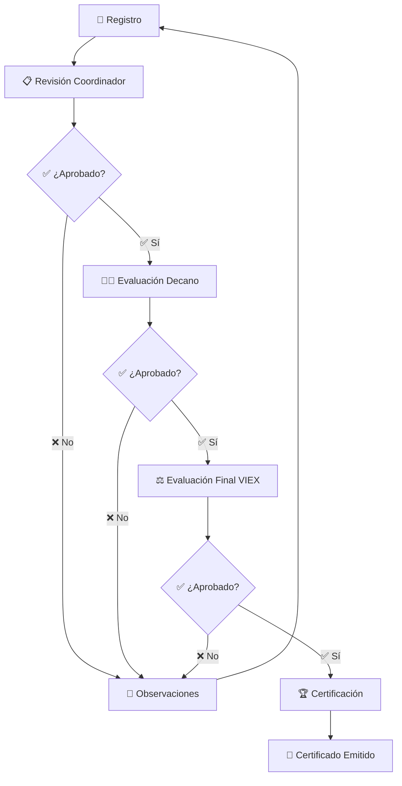

# 📋 Manual de Gestión de Trabajos de Extensión - VIEX

<div align="center">


**Guía Completa de Gestión de Trabajos**
*Desde la creación hasta la certificación*

</div>

## 🎯 Tipos de Trabajos de Extensión

### **🏗️ Proyectos de Extensión**

#### **🏛️ Proyectos Institucionales**
```
🎯 CARACTERÍSTICAS:
- 📊 Impacto: Institucional amplio
- 👥 Alcance: Múltiples unidades académicas
- 💰 Presupuesto: Mayor a $10,000
- ⏰ Duración: 6 meses a 2 años
- 📋 Aprobación: Consejo Académico
```

#### **🏢 Proyectos de Unidades Académicas**
```
🎯 CARACTERÍSTICAS:
- 📊 Impacto: Facultad/Centro específico
- 👥 Alcance: Una unidad académica
- 💰 Presupuesto: $1,000 - $10,000
- ⏰ Duración: 3 meses a 1 año
- 📋 Aprobación: Decano/Director
```

#### **👥 Proyectos de Servicio Social**
```
🎯 CARACTERÍSTICAS:
- 📊 Impacto: Comunitario directo
- 👥 Alcance: Comunidades específicas
- 💰 Presupuesto: Hasta $1,000
- ⏰ Duración: 1 a 6 meses
- 📋 Aprobación: Coordinador Extensión
```

### **🎓 Actividades de Extensión**

#### **📚 Educación Continua**
```
TIPOS INCLUIDOS:
- 🎓 Cursos libres
- 📜 Diplomados
- 🏆 Certificaciones profesionales
- 🧠 Talleres especializados
- 💼 Programas ejecutivos
```

#### **🎯 Intervenciones Específicas**
```
TIPOS INCLUIDOS:
- 🏥 Brigadas de salud
- ⚖️ Consultas jurídicas
- 🔬 Asesorías técnicas
- 🎨 Actividades culturales
- 🌱 Proyectos ambientales
```

### **📖 Publicaciones**
```
TIPOS ACEPTADOS:
- 📚 Libros académicos
- 📄 Artículos científicos
- 📰 Revistas especializadas
- 📊 Estudios de caso
- 🎯 Manuales técnicos
```

### **🔧 Asistencias Técnicas**
```
MODALIDADES:
- 🏭 Consultoría empresarial
- 🏛️ Asesoría gubernamental
- 🤝 Apoyo a ONGs
- 🔬 Transferencia tecnológica
- 📊 Estudios de mercado
```

---

## 🔄 Flujo de Trabajo General

### **📈 Ciclo de Vida Completo**



### **🚦 Estados del Trabajo**

| Estado | Descripción | Responsable | Tiempo Promedio |
|--------|-------------|-------------|-----------------|
| 📝 **Borrador** | En edición por el profesor | Profesor | Variable |
| ⏳ **En Revisión** | Pendiente de revisión inicial | Coordinador | 3-5 días |
| 👁️ **En Evaluación** | Revisión por autoridad académica | Decano/Director | 5-7 días |
| ⚖️ **Evaluación Final** | Validación final VIEX | Admin VIEX | 2-3 días |
| ✅ **Aprobado** | Trabajo validado completamente | - | - |
| 🏆 **Certificado** | Certificación emitida | Admin VIEX | 1 día |
| ❌ **Rechazado** | No cumple requisitos | Variable | - |
| 🔄 **Con Observaciones** | Requiere correcciones | Profesor | Variable |

---

## 👨‍🏫 Gestión desde la Perspectiva del Profesor

### **➕ Creación de Nuevo Trabajo**

#### **🎯 Paso 1: Selección de Tipo**
```
WIZARD DE CREACIÓN:
┌─────────────────────────────────────────┐
│ 🎯 ¿Qué tipo de trabajo registrarás?   │
├─────────────────────────────────────────┤
│ 🏗️ [Proyecto de Extensión]            │
│    📊 Impacto comunitario sustancial   │
│                                         │
│ 🎓 [Actividad de Extensión]           │
│    📚 Educación o intervención puntual │
│                                         │
│ 📖 [Publicación]                       │
│    📄 Material académico o técnico     │
│                                         │
│ 🔧 [Asistencia Técnica]               │
│    🏭 Consultoría o asesoría           │
└─────────────────────────────────────────┘
```

#### **📝 Paso 2: Información Básica**
```
FORMULARIO INTELIGENTE:
┌─────────────────────────────────────────┐
│ 📋 DATOS GENERALES                     │
├─────────────────────────────────────────┤
│ 🏷️ Título: ________________________   │
│ 📄 Descripción: ___________________   │
│ 🎯 Objetivos: _____________________   │
│ 👥 Población Meta: _________________   │
│ 🗓️ Fecha Inicio: [dd/mm/aaaa]       │
│ 🗓️ Fecha Fin: [dd/mm/aaaa]          │
│ 📍 Lugar: _________________________   │
└─────────────────────────────────────────┘
```

#### **👥 Paso 3: Equipo de Trabajo**
```
GESTIÓN DE PARTICIPANTES:
┌─────────────────────────────────────────┐
│ 👨‍🏫 PROFESOR RESPONSABLE              │
│ [Pre-llenado con tus datos]            │
├─────────────────────────────────────────┤
│ 👥 PARTICIPANTES ADICIONALES           │
│ [🔍 Buscar] [➕ Agregar Manual]       │
│                                         │
│ 👤 Dr. María González (30%)           │
│    📧 maria.gonzalez@up.ac.pa         │
│    [✏️ Editar] [❌ Quitar]            │
│                                         │
│ [➕ Agregar Otro Participante]         │
└─────────────────────────────────────────┘
```

### **💾 Guardado y Borradores**

#### **🔄 Guardado Automático**
```
CARACTERÍSTICAS:
- ⏰ Cada 30 segundos
- 🔄 Al cambiar de campo
- 📁 Múltiples versiones
- 🔍 Historial de cambios
- 📧 Notificación de guardado
```

#### **📋 Gestión de Borradores**
```
MIS BORRADORES:
┌─────────────────────────────────────────┐
│ 📄 "Proyecto Ambiental" - 85% completo │
│    🕒 Última edición: Hace 2 horas     │
│    [▶️ Continuar] [📋 Duplicar]        │
├─────────────────────────────────────────┤
│ 📄 "Capacitación Rural" - 60% completo │
│    🕒 Última edición: Ayer             │
│    [▶️ Continuar] [🗑️ Eliminar]       │
└─────────────────────────────────────────┘
```

### **📤 Envío para Revisión**

#### **✅ Lista de Verificación Pre-envío**
```
CHECKLIST OBLIGATORIO:
☑️ Título descriptivo y claro
☑️ Descripción completa (mín. 200 palabras)
☑️ Objetivos específicos definidos
☑️ Población meta identificada
☑️ Fechas de ejecución establecidas
☑️ Lugar de realización especificado
☑️ Participantes confirmados
☑️ Documentos adjuntos subidos
☐ Presupuesto detallado (si aplica)
☐ Cronograma de actividades
```

---

## 👨‍💼 Gestión desde la Perspectiva del Coordinador

### **📋 Cola de Revisión**

#### **🎯 Dashboard de Pendientes**
```
TRABAJOS POR REVISAR:
┌─────────────────────────────────────────┐
│ 🔴 URGENTES (>5 días)                  │
│ 📄 "Capacitación Técnica"              │
│    👤 Dr. Carlos López                 │
│    📅 Recibido: 07/01/2024             │
│    [🚨 REVISAR AHORA]                  │
├─────────────────────────────────────────┤
│ 🟡 NORMALES (3-5 días)                │
│ 📄 "Proyecto Social"                   │
│    👤 Dra. Ana Martínez                │
│    📅 Recibido: 10/01/2024             │
│    [👁️ Revisar] [📧 Contactar]        │
├─────────────────────────────────────────┤
│ 🟢 RECIENTES (<3 días)                │
│ 📄 "Publicación Científica"            │
│    👤 Dr. Luis Rodríguez               │
│    📅 Recibido: 12/01/2024             │
│    [👁️ Revisar]                       │
└─────────────────────────────────────────┘
```

### **👁️ Proceso de Revisión**

#### **📊 Vista de Evaluación**
```
PANTALLA DE REVISIÓN:
┌─────────────────────────────────────────┐
│ 📄 TÍTULO: "Proyecto Comunitario..."   │
│ 👤 PROFESOR: Dr. María González        │
│ 📅 FECHAS: 15/02/24 - 15/08/24        │
├─────────────────────────────────────────┤
│ 📋 CRITERIOS DE EVALUACIÓN            │
│                                         │
│ ✅ Claridad del título                 │
│ ✅ Coherencia de objetivos             │
│ ✅ Viabilidad del proyecto             │
│ ⚠️ Presupuesto incompleto              │
│ ❌ Cronograma muy ambicioso            │
│                                         │
│ 📝 OBSERVACIONES:                      │
│ [____________________________]         │
│                                         │
│ [✅ APROBAR] [❌ RECHAZAR] [🔄 OBSERV] │
└─────────────────────────────────────────┘
```

#### **📝 Tipos de Observaciones**
```
CATEGORÍAS COMUNES:
🔧 TÉCNICAS:
- 📊 Presupuesto incompleto
- 📅 Cronograma no realista
- 🎯 Objetivos no específicos

📋 ADMINISTRATIVAS:
- 📄 Documentos faltantes
- 👥 Participantes sin confirmar
- 📧 Información de contacto incompleta

🎯 ACADÉMICAS:
- 📚 Marco teórico insuficiente
- 🔬 Metodología no clara
- 📊 Indicadores de impacto faltantes
```

### **📧 Comunicación con Profesores**

#### **💬 Plantillas de Comunicación**
```
MENSAJES PREDEFINIDOS:
┌─────────────────────────────────────────┐
│ ✅ APROBACIÓN:                         │
│ "Su trabajo ha sido aprobado..."       │
│                                         │
│ 🔄 OBSERVACIONES:                      │
│ "Se requieren ajustes menores..."      │
│                                         │
│ ❌ RECHAZO:                            │
│ "Lamentablemente el trabajo..."        │
│                                         │
│ [📝 Personalizar Mensaje]              │
└─────────────────────────────────────────┘
```

---

## 👨‍💻 Gestión desde la Perspectiva del Decano/Director

### **🎯 Vista Ejecutiva**

#### **📊 Dashboard Estratégico**
```
MÉTRICAS DE FACULTAD/CENTRO:
┌─────────────────────────────────────────┐
│ 📈 RENDIMIENTO GENERAL                 │
│ Trabajos Activos: 45 (+12% vs mes ant.)│
│ Profesores Participando: 78% del total │
│ Impacto Comunitario: 2,340 beneficiar. │
│ Presupuesto Ejecutado: $67,890         │
├─────────────────────────────────────────┤
│ 🎯 METAS ANUALES                       │
│ ████████████░░░░ 75% completado        │
│ Meta: 60 trabajos | Actual: 45         │
│ Faltan: 15 trabajos para cumplir meta  │
└─────────────────────────────────────────┘
```

### **⚖️ Proceso de Aprobación**

#### **📋 Lista de Aprobación**
```
TRABAJOS PARA APROBACIÓN FINAL:
┌─────────────────────────────────────────┐
│ 🏆 PROYECTOS DE ALTO IMPACTO           │
│ 📄 "Desarrollo Rural Sostenible"       │
│    💰 Presupuesto: $8,500              │
│    👥 Beneficiarios: 500 familias      │
│    [👁️ Revisar] [✅ Aprobar]          │
├─────────────────────────────────────────┤
│ 🎓 ACTIVIDADES EDUCATIVAS              │
│ 📄 "Diplomado en Tecnología"           │
│    👥 Participantes: 30 profesionales  │
│    ⏰ Duración: 4 meses                │
│    [👁️ Revisar] [✅ Aprobar]          │
└─────────────────────────────────────────┘
```

---

## 👩‍⚖️ Gestión desde la Perspectiva del Administrador VIEX

### **🌐 Vista Global del Sistema**

#### **📊 Panel de Control Central**
```
CONTROL TOTAL DEL SISTEMA:
┌─────────────────────────────────────────┐
│ 🌍 TODAS LAS UNIDADES ACADÉMICAS       │
│ Total Trabajos: 1,247                  │
│ En Proceso: 189                        │
│ Listos para Certificar: 67             │
│ Certificados Emitidos: 456             │
├─────────────────────────────────────────┤
│ 📈 TENDENCIAS                          │
│ Crecimiento Mensual: +22%              │
│ Participación Profesores: 89%          │
│ Tiempo Promedio Proceso: 18 días       │
│ Satisfacción Usuario: 4.7/5.0          │
└─────────────────────────────────────────┘
```

### **🏆 Proceso de Certificación**

#### **✅ Cola de Certificación**
```
LISTOS PARA CERTIFICAR:
┌─────────────────────────────────────────┐
│ 📄 "Proyecto Educativo Rural"          │
│    🏛️ Facultad de Humanidades         │
│    👤 Dra. Carmen Rodríguez            │
│    ✅ Completado: 15/01/2024           │
│    [🏆 CERTIFICAR] [📄 Ver Detalles]   │
├─────────────────────────────────────────┤
│ 📄 "Asistencia Técnica Empresarial"    │
│    🏛️ Facultad de Ingeniería          │
│    👤 Ing. Roberto Pérez               │
│    ✅ Completado: 16/01/2024           │
│    [🏆 CERTIFICAR] [📄 Ver Detalles]   │
└─────────────────────────────────────────┘
```

#### **📜 Generación de Certificados**
```
PROCESO DE CERTIFICACIÓN:
1. ✅ Validación final de requisitos
2. 📊 Verificación de documentos
3. 🎯 Cálculo de horas/valor
4. 📜 Generación automática PDF
5. 🔐 Firma digital autorizada
6. 📧 Envío automático al profesor
7. 💾 Archivo en expediente digital
```

---

## 📊 Reportes y Estadísticas

### **📈 Tipos de Reportes Disponibles**

#### **👨‍🏫 Para Profesores**
```
MIS REPORTES:
- 📊 Resumen anual de actividades
- 📈 Progreso de proyectos activos
- 🏆 Certificaciones obtenidas
- ⏰ Cronograma de compromisos
- 💰 Presupuestos ejecutados
```

#### **👨‍💼 Para Coordinadores**
```
REPORTES DE UNIDAD:
- 📊 Estado general de trabajos
- 👥 Participación por profesor
- 📈 Tendencias mensuales
- 🎯 Cumplimiento de metas
- 💰 Ejecución presupuestaria
```

#### **👨‍💻 Para Decanos/Directores**
```
REPORTES EJECUTIVOS:
- 📊 Dashboard ejecutivo
- 📈 Análisis comparativo
- 🎯 KPIs de extensión
- 💰 Impacto económico
- 🏆 Ranking de desempeño
```

#### **👩‍⚖️ Para Administradores VIEX**
```
REPORTES INSTITUCIONALES:
- 🌐 Vista global sistema
- 📊 Estadísticas consolidadas
- 📈 Análisis de tendencias
- 🎯 Métricas de eficiencia
- 📋 Auditoría completa
```

### **📄 Formatos de Exportación**

```
FORMATOS DISPONIBLES:
- 📄 PDF (presentación)
- 📊 Excel (análisis)
- 📈 CSV (datos puros)
- 🖼️ PNG/JPG (gráficos)
- 📧 Email (envío directo)
```

---

## 🔔 Sistema de Notificaciones

### **📧 Tipos de Notificaciones**

#### **⚡ En Tiempo Real**
```
NOTIFICACIONES INSTANTÁNEAS:
- 🟢 Trabajo aprobado
- 🔴 Observaciones recibidas
- 🔵 Estado actualizado
- 🟡 Plazo próximo a vencer
- 🟣 Certificación lista
```

#### **📅 Programadas**
```
RECORDATORIOS AUTOMÁTICOS:
- 📧 Diarios: Tareas pendientes
- 📧 Semanales: Resumen de actividad
- 📧 Mensuales: Reporte estadístico
- 📧 Trimestrales: Evaluación de metas
```

### **⚙️ Configuración de Notificaciones**

```
PERSONALIZACIÓN:
┌─────────────────────────────────────────┐
│ 📧 Email:                              │
│ ☑️ Cambios de estado                   │
│ ☑️ Recordatorios de plazos             │
│ ☐ Comunicaciones generales             │
│                                         │
│ 🔔 Push (navegador):                   │
│ ☑️ Alertas urgentes                    │
│ ☐ Recordatorios diarios                │
│                                         │
│ 📱 SMS (opcional):                     │
│ ☑️ Solo emergencias                    │
│ ☐ Todas las notificaciones             │
└─────────────────────────────────────────┘
```

---

## 🎯 Mejores Prácticas

### **✅ Para Profesores**

#### **📝 Al Crear Trabajos**
```
CONSEJOS DE ÉXITO:
- 🎯 Títulos claros y descriptivos
- 📄 Descripciones completas (min. 200 palabras)
- 🗓️ Cronogramas realistas
- 💰 Presupuestos detallados
- 👥 Equipos de trabajo confirmados
- 📎 Documentos de soporte adjuntos
```

#### **📋 Durante el Proceso**
```
MANTENIMIENTO EFECTIVO:
- 🔄 Revisar observaciones rápidamente
- 📧 Comunicación proactiva
- 📊 Seguimiento regular del progreso
- 💾 Backup de documentos importantes
- 📱 Mantener datos de contacto actualizados
```

### **✅ Para Coordinadores**

#### **⏰ Gestión de Tiempo**
```
EFICIENCIA EN REVISIÓN:
- 🎯 Dedicar 2-3 horas diarias a revisiones
- 📋 Procesar trabajos por orden de llegada
- 🔍 Usar plantillas para observaciones
- 📧 Comunicación inmediata de decisiones
- 📊 Reportes semanales de progreso
```

### **✅ Para Decanos/Directores**

#### **🎯 Gestión Estratégica**
```
LIDERAZGO EFECTIVO:
- 📊 Monitoreo regular de métricas
- 🎯 Establecimiento de metas claras
- 👥 Motivación del equipo académico
- 💰 Optimización de recursos
- 🔄 Evaluación continua de procesos
```

---

<div align="center">

**🎯 ¡Ahora tienes el conocimiento completo para gestionar trabajos de extensión en VIEX!**

[🏠 Volver al Índice](README.md) | [⬅️ Anterior: Navegación](03-navegacion-dashboard.md) | [➡️ Siguiente: Formularios](05-formularios-campos.md)

*Universidad de Panamá - Vicerrectoría de Extensión*

</div>
