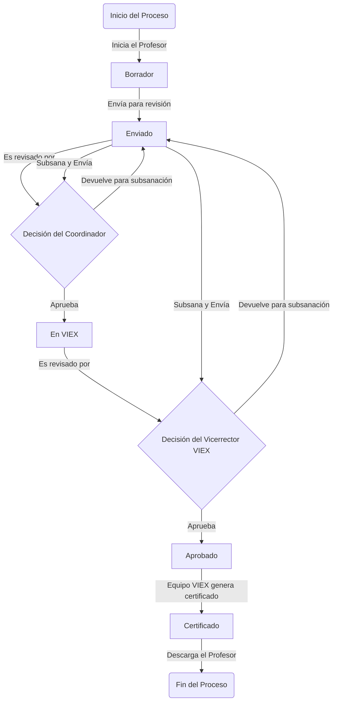

# **Casos de Uso**
## **ÍNDICE**

- [**Casos de Uso**](#casos-de-uso)
  - [**ÍNDICE**](#índice)
  - [**1. Todos los Usuarios**](#1-todos-los-usuarios)
  - [**2. Profesores (Docentes)**](#2-profesores-docentes)
  - [**3. Coordinadores de Extensión (por Unidad Académica)**](#3-coordinadores-de-extensión-por-unidad-académica)
  - [_4_. Vicerrector VIEX (Aprobación Institucional)](#4-vicerrector-viex-aprobación-institucional)
  - [**6. Administradores del Sistema**](#6-administradores-del-sistema)
    - [Scriptr de login actualizado con validaciones y mensajes mejorados](#scriptr-de-login-actualizado-con-validaciones-y-mensajes-mejorados)

---
**Flujo de vida de un Trabajo de Extensión en el PRCTE**



**Detalle**

- El docente inicia creando un **borrador**.  
- Cuando lo considera listo, lo **envía** y pasa a estado **Enviado**.

- El **Coordinador de Extensión** de su unidad lo revisa:  
  - Si está correcto, lo **aprueba** y el trabajo pasa a **En VIEX**.  
  - Si necesita correcciones, lo **devuelve**; el docente subsana y lo reenvía.

- Una vez en VIEX, el **Vicerrector o evaluador designado** lo analiza:  
- Puede **devolverlo nuevamente** para subsanación (vuelve al docente).  
- O lo **aprueba** definitivamente.

- Al ser aprobado, el equipo de la Vicerrectoría **genera el certificado** oficial.  
- Finalmente, el docente recibe la notificación y **descarga su certificado**, concluyendo el proceso.

- En cualquier momento de devolución, el trabajo regresa al docente para corrección y puede ser reenviado cuantas veces sea necesario hasta su aprobación final. 


## **1. Todos los Usuarios**

| Caso de Uso | Descripción                                                   | Prioridad | Estado          |
| ----------- | ------------------------------------------------------------- | --------- | --------------- |
| **UC-001**  | Navegar por la **Landing Page** institucional                 | Alta      | No implementado |
| **UC-002**  | **Iniciar sesión** con cédula/código de profesor y contraseña | Crítica   | Parcialmente Implementado |
| **UC-003**  | **Cerrar sesión** de forma segura                             | Alta      | Implementado |
| **UC-004**  | **Recuperar contraseña** vía correo institucional             | Alta      | Implementado |
| **UC-005**  | Ver **políticas de uso** y **manual de usuario**              | Media     | No implementado |
| **UC-006**  | Cambiar idioma (español por defecto)                          | Baja      | No implementado |

> **Nota:** No se permite registro público. Acceso solo por usuarios validados en el sistema de personal UP.

---

## **2. Profesores (Docentes)**

| Caso de Uso    | Descripción                                                                                    | Prioridad | Estado       |
| -------------- | ---------------------------------------------------------------------------------------------- | --------- | ------------ |
| **UC-DOC-001** | Ver **lista de mis trabajos de extensión** (con filtros: estado, tipo, fecha)                  | Alta      | Implementado |
| **UC-DOC-002** | **Crear un nuevo trabajo de extensión** (proyecto, actividad, publicación, asistencia técnica) | Crítica   | Implementado |
| **UC-DOC-003** | **Editar un trabajo en estado `borrador` o `requiere_corrección`**                             | Alta      | Implementado |
| **UC-DOC-004** | **Eliminar un trabajo en estado `borrador`**                                                   | Media     | Implementado |
| **UC-DOC-005** | **Enviar trabajo a revisión** (cambia estado a `enviado`)                                      | Crítica   | Implementado |
| **UC-DOC-006** | **Subir evidencias** (PDF, imágenes, documentos) usando Spatie MediaLibrary                    | Alta      | Implementado |
| **UC-DOC-007** | **Ver comentarios y retroalimentación** de coordinadores/evaluadores                           | Alta      | Implementado |
| **UC-DOC-008** | **Gestionar participantes/colaboradores** (docentes, estudiantes, externos)                    | Alta      | No Implementado |
| **UC-DOC-009** | **Buscar mis trabajos** por título, fecha, estado, tipo                                        | Media     | Implementado |
| **UC-DOC-010** | **Subsanar observaciones** en trabajos devueltos                                               | Alta      | Implementado |
| **UC-DOC-011** | **Descargar certificación oficial** (PDF con código único)                                     | Crítica   | Implementado |
| **UC-DOC-012** | **Recibir notificaciones automáticas** (estado, comentarios, aprobación)                       | Alta      | Implementado |
| **UC-DOC-013** | **Comunicarse con coordinador** vía chat interno o comentarios                                 | Media     | Implementado |
| **UC-DOC-014** | **Visualizar historial completo** de trámites por trabajo                                      | Alta      | Implementado |
| **UC-DOC-015** | **Generar reporte personal** de trabajos aprobados (PDF/Excel)                                 | Media     | Implementado |

---

## **3. Coordinadores de Extensión (por Unidad Académica)**

| Caso de Uso      | Descripción                                                                                         | Prioridad | Estado          |
| ---------------- | --------------------------------------------------------------------------------------------------- | --------- | --------------- |
| **UC-COORD-001** | Ver **lista de trabajos enviados** de su unidad académica                                           | Crítica   | Implementado |
| **UC-COORD-002** | **Filtrar trabajos** por estado, profesor, tipo, fecha                                              | Alta      | Parcialmente Implementado |
| **UC-COORD-003** | **Revisar detalles completos** del trabajo y evidencias                                             | Crítica   | Implementado |
| **UC-COORD-004** | **Aprobar trabajo** → pasa a VIEX (`en_revision_viex`)                                              | Crítica   | Implementado |
| **UC-COORD-005** | **Devolver con observaciones** → estado `requiere_corrección`                                       | Crítica   | Implementado |
| **UC-COORD-006** | **Marcar como completados hitos de evaluación** → lista de puntos a completar segun tipo de trabajo | Crítica   | No Implementado |
| **UC-COORD-007** | **Agregar comentarios obligatorios** al devolver                                                    | Crítica   | Parcialmente Implementado |
| **UC-COORD-008** | **Notificar automáticamente** al docente sobre decisión                                             | Alta      | Implementado |
| **UC-COORD-009** | **Ver historial de revisiones** por trabajo                                                         | Alta      | Parcialmente Implementado |
| **UC-COORD-010** | **Generar reporte de gestión** (aprobados, devueltos, pendientes)                                   | Media     | No Implementado |
| **UC-COORD-011** | **Comunicarse con docente** vía plataforma                                                          | Media     | No Implementado |

> **Ámbito:** Solo trabajos de su facultad/centro regional.

---

## _4_. Vicerrector VIEX (Aprobación Institucional)

| Caso de Uso    | Descripción                                                         | Prioridad | Estado          |
| -------------- | ------------------------------------------------------------------- | --------- | --------------- |
| **UC-VIC-001** | Ver **lista de trabajos enviados por coordinadores**                | Crítica   | Parcialmente Implementado |
| **UC-VIC-002** | **Filtrar trabajos** por unidad, tipo, ODS, fecha                   | Alta      | No Implementado |
| **UC-VIC-003** | **Revisar detalles completos** del trabajo y evidencias             | Crítica   | Implementado |
| **UC-VIC-004** | **Aprobar trabajo institucionalmente** → pasa a certificación       | Crítica   | Implementado |
| **UC-VIC-005** | **Devolver con observaciones** → estado `requiere_corrección`       | Crítica   | Implementado |
| **UC-VIC-006** | **Agregar comentarios obligatorios** al devolver                    | Crítica   | Parcialmente Implementado |
| **UC-VIC-007** | **Notificar automáticamente** al docente sobre decisión             | Alta      | Implementado |
| **UC-VIC-008** | **Ver historial de revisiones** por trabajo                         | Alta      | Parcialmente Implementado |
| **UC-VIC-009** | **Generar reportes institucionales** (por facultad, tipo, ODS, año) | Alta      | No Implementado |
| **UC-VIC-010** | **Exportar datos** a Excel/PDF                                      | Alta      | No Implementado |
| **UC-VIC-011** | **Recibir alertas** de trabajos pendientes > 15 días                | Alta      | No Implementado |

---

## **6. Administradores del Sistema**

| Caso de Uso    | Descripción                                                         | Prioridad | Estado          |
| -------------- | ------------------------------------------------------------------- | --------- | --------------- |
| **UC-ADM-001** | **Gestionar usuarios** (crear, editar, desactivar)                  | Crítica   | Implementado |
| **UC-ADM-002** | **Asignar roles y permisos** (Spatie)                               | Crítica   | Implementado |
| **UC-ADM-003** | **Configurar criterios de evaluación** (nombre, peso, máx. puntaje) | Alta      | Implementado |
| **UC-ADM-004** | **Gestionar tipos de proyectos institucionales**                    | Media     | Implementado |
| **UC-ADM-005** | **Configurar parámetros globales** (plazos, notificaciones)         | Alta      | No Implementado |
| **UC-ADM-006** | **Ver logs de actividad y auditoría**                               | Alta      | Parcialmente Implementado |
| **UC-ADM-007** | **Realizar copias de seguridad** (automatizado)                     | Crítica   | No Implementado |
| **UC-ADM-008** | **Monitorear rendimiento** (Horizon, Telescope)                     | Media     | No Implementado |
| **UC-ADM-009** | **Gestionar colas de trabajos** (notificaciones, PDF)               | Alta      | Parcialmente Implementado |

---


Una vez resuelto el incidente INC 2025-003335 (se les envía el correo) donde se habilita el acceso a un grupo de vistas (archivo adjunto)  en reemplazo de tablas , se explica la función de las vistas y parámetros requeridos. Además datos de los 3 estamentos (profesor, administrativo, estudiantes) para validar si existe como usuario, como se utiliza UP_ADMSIS.PKG_VALIDA_USER.VALIDA_ESTAMENTO_USER.

VISTAS	Función	Parámetros
VPROFESORES_UBICACION	Vista de los datos del profesor y ubicación académica.	cédula(provincia, clase, tomo, folio)
VSEDES	Vista de las Sedes	
VFACULTADES_UBC	Vista de las facultades de una sede	cod_sede
VESCUELAS_UBC	Vista de las escuelas de una sede, facultad	cod_sede, cod_facultad
VCARRERAS_UBC	Vista las carreras de una sede, facultad, escuela	cod_sede, cod_facultad, cod_escuela


### Scriptr de login actualizado con validaciones y mensajes mejorados
```php
<?php 
// INICIAR SESIÓN AL PRINCIPIO DEL ARCHIVO
session_start();
include("conecta.php");
error_reporting(0);
//ini_set('display_errors', 1);

$cestamento = "A";
$cprovincia = $_POST['cprovincia'];
$cclase = $_POST['cclase'];
$ctomo = $_POST['ctomo'];
$cfolio = $_POST['cfolio'];
$cpassword_input = $_POST['cpassword'];
$cpassword_md5 = md5($_POST['cpassword']);

// PRIMERO: Verificar si el usuario existe en T_USUARIOS
$cedula_completa = $cprovincia . "-" . $cclase . "-" . $ctomo . "-" . $cfolio;

echo "<!-- Debug: Cédula completa: $cedula_completa -->";

$sql_check_user = "SELECT ID, NOMBRE, APELLIDO, ESTADO, ID_TIPO_USUARIO 
                  FROM T_USUARIOS 
                  WHERE CEDULA = :cedula_completa";
$stmt_check = oci_parse($conn, $sql_check_user);

oci_bind_by_name($stmt_check, ":cedula_completa", $cedula_completa);

if (!oci_execute($stmt_check)) {
    $error = oci_error($stmt_check);
    die("Error al verificar usuario: " . $error['message']);
}

$usuario = oci_fetch_array($stmt_check, OCI_ASSOC);

echo "<!-- Debug: Usuario encontrado: " . print_r($usuario, true) . " -->";

if (!$usuario) {
    // Usuario no existe
    echo "<script src='https://cdn.jsdelivr.net/npm/sweetalert2@11'></script>";
    echo "<script>
    window.onload = function() {
        Swal.fire({
            title: 'Usuario no encontrado',
            text: 'La cédula proporcionada no está registrada en el sistema',
            icon: 'warning',
            confirmButtonText: 'Intentar de nuevo'
        }).then(() => {
            window.history.back();
        });
    };
    </script>";
    oci_free_statement($stmt_check);
    oci_close($conn);
    exit();
}

// SEGUNDO: Verificar el estado del usuario
if ($usuario['ESTADO'] != 1) {
    echo "<script src='https://cdn.jsdelivr.net/npm/sweetalert2@11'></script>";
    echo "<script>
    window.onload = function() {
        Swal.fire({
            title: 'Usuario inactivo',
            text: 'Su cuenta está desactivada. Contacte al administrador.',
            icon: 'error',
            confirmButtonText: 'Aceptar'
        }).then(() => {
            window.history.back();
        });
    };
    </script>";
    oci_free_statement($stmt_check);
    oci_close($conn);
    exit();
}

// TERCERO: Validar estamento y contraseña con el procedimiento almacenado
$cresp = 0;

echo "<!-- Debug: Antes de validar estamento -->";

$sql_valida_estamento = "BEGIN PKG_VALIDA_USER.VALIDA_ESTAMENTO_USER(:cestamento, :cprovincia, :cclase, :ctomo, :cfolio, :cpassword, :cresp); END;";
$stmt_valida = oci_parse($conn, $sql_valida_estamento);

oci_bind_by_name($stmt_valida, ":cestamento", $cestamento);
oci_bind_by_name($stmt_valida, ":cprovincia", $cprovincia);
oci_bind_by_name($stmt_valida, ":cclase", $cclase);
oci_bind_by_name($stmt_valida, ":ctomo", $ctomo);
oci_bind_by_name($stmt_valida, ":cfolio", $cfolio);
oci_bind_by_name($stmt_valida, ":cpassword", $cpassword_md5);
oci_bind_by_name($stmt_valida, ":cresp", $cresp, -1, SQLT_INT);

if (!oci_execute($stmt_valida)) {
    $error = oci_error($stmt_valida);
    die("Error al validar estamento: " . $error['message']);
}

echo "<!-- Debug: CRESP después de validación: $cresp -->";

// CUARTO: Si CRESP > 0, obtener detalles del usuario
if ($cresp > 0) {
    echo "<!-- Debug: CRESP > 0, procediendo a obtener detalles -->";
    
    $crespuesta = '';
    $cursor = oci_new_cursor($conn);

    $sql_detalle = "BEGIN PKG_VALIDA_USER.DETALLE_USUARIO_UP(:cprovincia, :cclase, :ctomo, :cfolio, :cestamento, :crespuesta, :cursor); END;";
    $stmt_detalle = oci_parse($conn, $sql_detalle);

    oci_bind_by_name($stmt_detalle, ":cprovincia", $cprovincia);
    oci_bind_by_name($stmt_detalle, ":cclase", $cclase);
    oci_bind_by_name($stmt_detalle, ":ctomo", $ctomo);
    oci_bind_by_name($stmt_detalle, ":cfolio", $cfolio);
    oci_bind_by_name($stmt_detalle, ":cestamento", $cestamento);
    oci_bind_by_name($stmt_detalle, ":crespuesta", $crespuesta, 200);
    oci_bind_by_name($stmt_detalle, ":cursor", $cursor, -1, OCI_B_CURSOR);

    if (!oci_execute($stmt_detalle)) {
        $error = oci_error($stmt_detalle);
        die("Error al obtener detalle del usuario: " . $error['message']);
    }

    oci_execute($cursor);
    
    if ($row = oci_fetch_array($cursor, OCI_ASSOC + OCI_RETURN_NULLS)) {
        echo "<!-- Debug: Row obtenido: " . print_r($row, true) . " -->";
        
        // CREAR VARIABLES DE SESIÓN
        $_SESSION['SEXO'] = $row['SEXO'] ?? 'No disponible';
        $_SESSION['CEDULA'] = $cedula_completa;
        $_SESSION['ESTAMENTO'] = $cestamento;
        $_SESSION['autenticado'] = "SI";
        $_SESSION['id_tipo_usuario'] = $usuario['ID_TIPO_USUARIO'];
        $_SESSION['nombre_usuario'] = $usuario['NOMBRE'] . " " . $usuario['APELLIDO'];
        $_SESSION['id_usuario'] = $usuario['ID'];

        echo "<!-- Debug: Sesiones creadas: " . print_r($_SESSION, true) . " -->";

        // Actualizar último login
        $sql_update_login = "UPDATE T_USUARIOS 
                            SET ULTIMOLOGIN = SYSDATE, 
                                ULTIMOIP = :ip 
                            WHERE CEDULA = :cedula";
        $stmt_update = oci_parse($conn, $sql_update_login);
        $ip_address = $_SERVER['REMOTE_ADDR'];
        oci_bind_by_name($stmt_update, ":ip", $ip_address);
        oci_bind_by_name($stmt_update, ":cedula", $cedula_completa);
        oci_execute($stmt_update);
        oci_free_statement($stmt_update);
        
        echo "<!-- Debug: Después de actualizar login -->";
    } else {
        echo "<!-- Debug: NO se pudo obtener row del cursor -->";
        // Si no se puede obtener el row, crear sesiones básicas con datos de T_USUARIOS
        $_SESSION['CEDULA'] = $cedula_completa;
        $_SESSION['ESTAMENTO'] = $cestamento;
        $_SESSION['autenticado'] = "SI";
        $_SESSION['id_tipo_usuario'] = $usuario['ID_TIPO_USUARIO'];
        $_SESSION['nombre_usuario'] = $usuario['NOMBRE'] . " " . $usuario['APELLIDO'];
        $_SESSION['id_usuario'] = $usuario['ID'];
        $_SESSION['SEXO'] = 'No especificado';
        
        echo "<!-- Debug: Sesiones creadas con datos básicos: " . print_r($_SESSION, true) . " -->";
    }
    
    // Determinar la URL de redirección
    $redirect_url = 'index.php';
    if ($cestamento == 'A') {
        $redirect_url = 'ver_agenda.php';
    } elseif ($cestamento == 'P') {
        $redirect_url = 'profesor_dashboard.php';
    }
    
    // Usar las variables de sesión reales
    $sexo = $_SESSION['SEXO'];
    $cedula = $_SESSION['CEDULA'];
    $estamento = $_SESSION['ESTAMENTO'];
    $autenticado = $_SESSION['autenticado'];
    $id_tipo_usuario = $_SESSION['id_tipo_usuario'];
    $nombre_usuario = $_SESSION['nombre_usuario'];
    $id_usuario = $_SESSION['id_usuario'];
    
    // Mostrar mensaje de éxito
    echo "<script src='https://cdn.jsdelivr.net/npm/sweetalert2@11'></script>";
    echo "<script>
    window.onload = function() {
        console.log('Variables REALES de sesión:', {
            SEXO: '$sexo',
            CEDULA: '$cedula',
            ESTAMENTO: '$estamento',
            autenticado: '$autenticado',
            id_tipo_usuario: '$id_tipo_usuario',
            nombre_usuario: '$nombre_usuario',
            id_usuario: '$id_usuario'
        });
        
        Swal.fire({
            title: '¡Bienvenido $nombre_usuario!',
            html: `Inicio de sesión exitoso<br><br>
                <div style='text-align: left; background: #f8f9fa; padding: 15px; border-radius: 5px; margin: 10px 0;'>
                   
                </div>
                <br><small style='color: #666;'>Redirigiendo automáticamente en 5 segundos...</small>`,
            icon: 'success',
            showConfirmButton: true,
            confirmButtonText: 'Continuar ahora',
            showCancelButton: true,
            cancelButtonText: 'Ver detalles',
            timer: 5000,
            timerProgressBar: true,
            width: '600px',
            didOpen: () => {
                setTimeout(() => {
                    window.location.href = '$redirect_url';
                }, 5000);
            }
        }).then((result) => {
            if (result.isConfirmed) {
                window.location.href = '$redirect_url';
            } else if (result.dismiss === Swal.DismissReason.cancel) {
                Swal.fire({
                    title: 'Detalles completos de sesión',
                    html: `<div style='text-align: left;'>
                          <strong>Información de sesión:</strong><br>
                          Session ID: '" . session_id() . "'<br>
                          Session Status: Activa<br>
                          <br><strong>Datos del usuario:</strong><br>
                          Nombre completo: $nombre_usuario<br>
                          </div>`,
                    icon: 'info',
                    confirmButtonText: 'Ir al sistema'
                }).then(() => {
                    window.location.href = '$redirect_url';
                });
            }
        });
    };
    </script>";

    oci_free_statement($stmt_detalle);
    oci_free_statement($cursor);

} else {
    echo "<!-- Debug: CRESP = 0, acceso denegado -->";
    // El usuario no tiene acceso a este estamento o contraseña incorrecta
    echo "<script src='https://cdn.jsdelivr.net/npm/sweetalert2@11'></script>";
    echo "<script>
    window.onload = function() {
        Swal.fire({
            title: 'Acceso denegado',
            text: 'Datos incorrectos o no tiene permisos para acceder como " . ($cestamento == 'E' ? 'Estudiante' : ($cestamento == 'A' ? 'Administrativo' : 'Profesor')) . "',
            icon: 'warning',
            confirmButtonText: 'Intentar de nuevo'
        }).then(() => {
            window.history.back();
        });
    };
    </script>";
}

oci_free_statement($stmt_check);
oci_free_statement($stmt_valida);
oci_close($conn);
?>
```