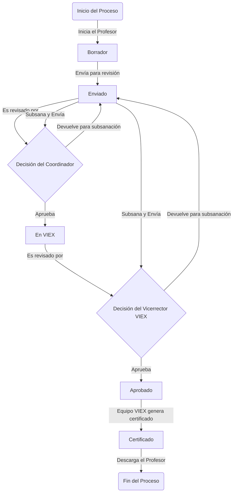

# **Casos de Uso**
## **ÍNDICE**

- [**Casos de Uso**](#casos-de-uso)
  - [**ÍNDICE**](#índice)
  - [**1. Todos los Usuarios**](#1-todos-los-usuarios)
  - [**2. Profesores (Docentes)**](#2-profesores-docentes)
  - [**3. Coordinadores de Extensión (por Unidad Académica)**](#3-coordinadores-de-extensión-por-unidad-académica)
  - [_4_. Vicerrector VIEX (Aprobación Institucional)](#4-vicerrector-viex-aprobación-institucional)
  - [**6. Administradores del Sistema**](#6-administradores-del-sistema)
  - [**Diagrama de Flujo General (Resumen)**](#diagrama-de-flujo-general-resumen)

---

## **1. Todos los Usuarios**

| Caso de Uso | Descripción                                                   | Prioridad | Estado          |
| ----------- | ------------------------------------------------------------- | --------- | --------------- |
| **UC-001**  | Navegar por la **Landing Page** institucional                 | Alta      | No implementado |
| **UC-002**  | **Iniciar sesión** con cédula/código de profesor y contraseña | Crítica   | No implementado |
| **UC-003**  | **Cerrar sesión** de forma segura                             | Alta      | No implementado |
| **UC-004**  | **Recuperar contraseña** vía correo institucional             | Alta      | No implementado |
| **UC-005**  | Ver **políticas de uso** y **manual de usuario**              | Media     | No implementado |
| **UC-006**  | Cambiar idioma (español por defecto)                          | Baja      | No implementado |

> **Nota:** No se permite registro público. Acceso solo por usuarios validados en el sistema de personal UP.

---

## **2. Profesores (Docentes)**

| Caso de Uso    | Descripción                                                                                    | Prioridad | Estado       |
| -------------- | ---------------------------------------------------------------------------------------------- | --------- | ------------ |
| **UC-DOC-001** | Ver **lista de mis trabajos de extensión** (con filtros: estado, tipo, fecha)                  | Alta      | Implementado |
| **UC-DOC-002** | **Crear un nuevo trabajo de extensión** (proyecto, actividad, publicación, asistencia técnica) | Crítica   | Implementado |
| **UC-DOC-003** | **Editar un trabajo en estado `borrador` o `requiere_corrección`**                             | Alta      | Implementado |
| **UC-DOC-004** | **Eliminar un trabajo en estado `borrador`**                                                   | Media     | Implementado |
| **UC-DOC-005** | **Enviar trabajo a revisión** (cambia estado a `enviado`)                                      | Crítica   | Implementado |
| **UC-DOC-006** | **Subir evidencias** (PDF, imágenes, documentos) usando Spatie MediaLibrary                    | Alta      | Implementado |
| **UC-DOC-007** | **Ver comentarios y retroalimentación** de coordinadores/evaluadores                           | Alta      | Implementado |
| **UC-DOC-008** | **Gestionar participantes/colaboradores** (docentes, estudiantes, externos)                    | Alta      | Implementado |
| **UC-DOC-009** | **Buscar mis trabajos** por título, fecha, estado, tipo                                        | Media     | Implementado |
| **UC-DOC-010** | **Subsanar observaciones** en trabajos devueltos                                               | Alta      | Implementado |
| **UC-DOC-011** | **Descargar certificación oficial** (PDF con código único)                                     | Crítica   | Implementado |
| **UC-DOC-012** | **Recibir notificaciones automáticas** (estado, comentarios, aprobación)                       | Alta      | Implementado |
| **UC-DOC-013** | **Comunicarse con coordinador** vía chat interno o comentarios                                 | Media     | Implementado |
| **UC-DOC-014** | **Visualizar historial completo** de trámites por trabajo                                      | Alta      | Implementado |
| **UC-DOC-015** | **Generar reporte personal** de trabajos aprobados (PDF/Excel)                                 | Media     | Implementado |

---

## **3. Coordinadores de Extensión (por Unidad Académica)**

| Caso de Uso      | Descripción                                                                                         | Prioridad | Estado          |
| ---------------- | --------------------------------------------------------------------------------------------------- | --------- | --------------- |
| **UC-COORD-001** | Ver **lista de trabajos enviados** de su unidad académica                                           | Crítica   | No Implementado |
| **UC-COORD-002** | **Filtrar trabajos** por estado, profesor, tipo, fecha                                              | Alta      | No Implementado |
| **UC-COORD-003** | **Revisar detalles completos** del trabajo y evidencias                                             | Crítica   | No Implementado |
| **UC-COORD-004** | **Aprobar trabajo** → pasa a VIEX (`en_revision_viex`)                                              | Crítica   | No Implementado |
| **UC-COORD-005** | **Devolver con observaciones** → estado `requiere_corrección`                                       | Crítica   | No Implementado |
| **UC-COORD-006** | **Marcar como completados hitos de evaluación** → lista de puntos a completar segun tipo de trabajo | Crítica   | No Implementado |
| **UC-COORD-007** | **Agregar comentarios obligatorios** al devolver                                                    | Crítica   | No Implementado |
| **UC-COORD-008** | **Notificar automáticamente** al docente sobre decisión                                             | Alta      | No Implementado |
| **UC-COORD-009** | **Ver historial de revisiones** por trabajo                                                         | Alta      | No Implementado |
| **UC-COORD-010** | **Generar reporte de gestión** (aprobados, devueltos, pendientes)                                   | Media     | No Implementado |
| **UC-COORD-011** | **Comunicarse con docente** vía plataforma                                                          | Media     | No Implementado |

> **Ámbito:** Solo trabajos de su facultad/centro regional.

---

## _4_. Vicerrector VIEX (Aprobación Institucional)

| Caso de Uso    | Descripción                                                         | Prioridad | Estado          |
| -------------- | ------------------------------------------------------------------- | --------- | --------------- |
| **UC-VIC-001** | Ver **lista de trabajos enviados por coordinadores**                | Crítica   | No Implementado |
| **UC-VIC-002** | **Filtrar trabajos** por unidad, tipo, ODS, fecha                   | Alta      | No Implementado |
| **UC-VIC-003** | **Revisar detalles completos** del trabajo y evidencias             | Crítica   | No Implementado |
| **UC-VIC-004** | **Aprobar trabajo institucionalmente** → pasa a certificación       | Crítica   | No Implementado |
| **UC-VIC-005** | **Devolver con observaciones** → estado `requiere_corrección`       | Crítica   | No Implementado |
| **UC-VIC-006** | **Agregar comentarios obligatorios** al devolver                    | Crítica   | No Implementado |
| **UC-VIC-007** | **Notificar automáticamente** al docente sobre decisión             | Alta      | No Implementado |
| **UC-VIC-008** | **Ver historial de revisiones** por trabajo                         | Alta      | No Implementado |
| **UC-VIC-009** | **Generar reportes institucionales** (por facultad, tipo, ODS, año) | Alta      | No Implementado |
| **UC-VIC-010** | **Exportar datos** a Excel/PDF                                      | Alta      | No Implementado |
| **UC-VIC-011** | **Recibir alertas** de trabajos pendientes > 15 días                | Alta      | No Implementado |

---

## **6. Administradores del Sistema**

| Caso de Uso    | Descripción                                                         | Prioridad | Estado          |
| -------------- | ------------------------------------------------------------------- | --------- | --------------- |
| **UC-ADM-001** | **Gestionar usuarios** (crear, editar, desactivar)                  | Crítica   | No implementado |
| **UC-ADM-002** | **Asignar roles y permisos** (Spatie)                               | Crítica   | No implementado |
| **UC-ADM-003** | **Configurar criterios de evaluación** (nombre, peso, máx. puntaje) | Alta      | No implementado |
| **UC-ADM-004** | **Gestionar tipos de proyectos institucionales**                    | Media     | No implementado |
| **UC-ADM-005** | **Configurar parámetros globales** (plazos, notificaciones)         | Alta      | No implementado |
| **UC-ADM-006** | **Ver logs de actividad y auditoría**                               | Alta      | No implementado |
| **UC-ADM-007** | **Realizar copias de seguridad** (automatizado)                     | Crítica   | No implementado |
| **UC-ADM-008** | **Monitorear rendimiento** (Horizon, Telescope)                     | Media     | No implementado |
| **UC-ADM-009** | **Gestionar colas de trabajos** (notificaciones, PDF)               | Alta      | No implementado |

---

## **Diagrama de Flujo General (Resumen)**

